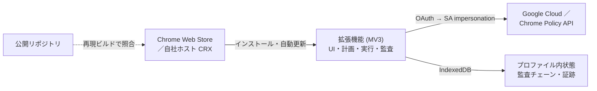

# Secure Gateway Studio — Chrome 拡張機能 移行実装計画

> **履歴資料です。** これは移行時点の設計判断とフェーズを残す文書であり、0.2.1 の
> 配布・対応機能・テスト手順を定める運用ガイドではありません。現行仕様は
> [`secure-gateway-studio/README.md`](../secure-gateway-studio/README.md) と
> [`extension/docs/WEB_STORE_SUBMISSION.md`](../secure-gateway-studio/extension/docs/WEB_STORE_SUBMISSION.md)
> を参照してください。0.2.1 の配布物は Web Store 用 ZIP だけです。

Updated: 2026-08-04
Revision: 6（`7a50e0c` で取り込んだ Path B とコンフォーマンスレビューを反映。
revision 1–5 の経緯は §19）

## 1. この文書の位置づけ

[CHROME_SECURE_GATEWAY_WEB_APP_IMPLEMENTATION_PLAN.md](CHROME_SECURE_GATEWAY_WEB_APP_IMPLEMENTATION_PLAN.md)
が製品仕様（何を作るか）を定める。本文書は**実行形態の移行**（どこで動かすか）だけ
を定め、製品仕様には手を入れない。

移行の内容は、ローカル Web アプリ（FastAPI + ループバック）を Chrome 拡張機能
（Manifest V3）に置き換えることである。ホスト型 SPA とローカルエージェントを併用
する案は破棄した（§19）。

製品仕様側の §17 コンフォーマンスレビューと §18 次の一手は、本移行の前提条件と
して §4 に取り込んである。両文書は併読を前提とする。

## 2. 現在地

`7a50e0c` 時点の実測値。

| 項目 | 値 |
|---|---|
| バックエンド実装 | 10,496 行 (Python) |
| バックエンドテスト | 4,455 行 / 12 ファイル |
| フロントエンド | 7,546 行 (TS/TSX) |
| 記録されたゲート結果 | backend 135 tests / frontend 17 tests / coverage 77%（floor 75%） |

製品仕様 §17.1 の通り、アーキテクチャ・承認消費の単一トランザクション・監査チェー
ン・中断検出・所有権境界のロールバックは適合確認済み。移植はこの状態を出発点とする。

## 3. 移行の骨子

確定事項：

1. 配布物は拡張機能ひとつ。ローカルエージェントもホスト型 SPA も存在しない。
2. UI は `chrome-extension://` オリジン。`test-domain.dev` は配布とドキュメントの
   入口に限定する。
3. 認証は `chrome.identity`。拡張 A/C とローカル B の対応3実装で必要な
   プロジェクト権限の和集合だけを持つデプロイヤ SA への impersonation は維持する
   （§7.2）。選択した経路の Plan はその部分集合だけを要求・実行し、長期 SA 鍵の
   禁止も維持する。
4. 対応は Chrome と Edge のみ。
5. ソース公開と再現ビルドを供給網対策の中核に据える（§11）。
6. マルチテナントは導入しない。

## 4. 移植前に閉じる項目

製品仕様 §17.2 の乖離と §18 の次の一手は、移植の前提を変えるものが含まれる。移植
着手前に処理する必要があるものを分離する。

### 4.1 移植量を直接左右する決定

**Production の扱い（製品仕様 §18.1.3）。** UI ではモードカードが `disabled` だが、
バックエンドは Production を完全実装している。ここを決めないと移植量が確定しない。

Production を対象外とする場合、以下は移植不要になる：二ゾーン構成のリージョナル
MIG、オートスケーラ、内部 TCP ロードバランサ、SSL ヘルスチェック、Cloud NAT、
不変イメージ要件、および `google_executor.py` の対応部分。これは移植量の削減として
最大である。

**この決定は移植の必要性としては解消した。** Production 経路（インスタンステンプレート、
リージョナル MIG、オートスケーラ、内部ロードバランサ、SSL ヘルスチェック、hardened
image 前提の起動スクリプト）は移植済みで、6シナリオ121リクエストのゴールデンで固定
してある。Production を対象外とするかは製品判断として残るが、**移植作業を止める要因
ではなくなった。**

### 4.2 移植前に片付ける負債

| 項目 | 出典 | 理由 |
|---|---|---|
| フロントエンド Dependabot のブロック解消 | 仕様 §18.1.1 | 移植で TS 依存が大幅に増える。更新経路が詰まったまま着手すると悪化する |
| README の Admin Directory 記述訂正、`SGSTUDIO_ACCESS_POLICY_ID` の前提条件化 | 仕様 §18.1.2, §17.3 | 拡張のオンボーディング文書の元になる |
| ChromeOS 限定制約の正式撤回 | 仕様 §17.2.3 | 存在しない制約を移植しないため |
| リポジトリ整理（§12.1） | 本文書 | 公開リポジトリの衛生 |

### 4.3 参照実装を先に完成させる項目

製品仕様 §18.2 の correctness work は **Python 側で先に実装する。** 移植後に TS 側
だけで実装すると、§13 の等価性オラクルが不完全な参照実装を基準にすることになる。

| 項目 | 出典 | 備考 |
|---|---|---|
| Path B の Global Access プリフライト | 仕様 §18.2.4, §16.6.2 | Path B は最初の移植対象なので先に必要 |
| Path B のクロスプロジェクト upstream VPC | 仕様 §18.2.5, §16.6.1 | 同上 |
| T08/T09 と到達可能モードの整合 | 仕様 §18.2.6 | §4.1 の Production 決定に従属 |

### 4.4 移行で自動的に解消するもの

移植の副作用として消える乖離。個別対応は不要。

- **Origin 検証のヘッダ欠落時スキップ**（仕様 §17.2.7）。拡張には許可オリジンの概念
  がないため、指摘ごと消滅する。
- ループバック束縛、セッション nonce、trusted-host、CSP の二重化。いずれも
  プロセス間通信が消えることで不要になる。

### 4.5 移行で新たに必須になるもの

**クロスリスタートのミューテーション再開。** 製品仕様 §18.4 では Phase C の deferred
として扱われているが、**MV3 では必須である。** service worker は任意の時点で停止す
るため、再開できない実行系は成立しない。deferred から Phase 3 の必須要件へ格上げす
る（§9）。

## 5. 移植戦略：Path B 先行

製品仕様 §16.4 により、Path B が計画するのは既存 VPC、アクセスレベル、ゲートウェイ、
ゲートウェイ IAM、upstream-access IAM、アプリケーション、アプリケーション IAM、
強制インストール拡張2種、管理対象拡張設定、Service Discovery プロキシ override の
みである。サブネット、ルータ、NAT、サービスアカウント、アドレス、シークレット、
証明書、VM、テンプレート、MIG、オートスケーラ、ヘルスチェック、バックエンドサービ
ス、転送ルール、ファイアウォール、DNS は**一切作らない**。

移植上の意味は大きい。

| 観点 | Path B | Path A |
|---|---|---|
| プロバイダ表面 | BeyondCorp + IAM + Chrome Policy | 上記 + Compute + DNS + Secret Manager + CA Service |
| `certificates.py`（303 行、WebCrypto 再実装） | 不要 | 必要 |
| 長時間ポーリング（MIG healthy 待ち） | 不要 | 必要 |
| 受け入れ試験 | T05, T06, T07 | T01–T07 |

**したがって Path B を最初の縦切りとする。** ディスカバリ→計画→承認→適用→監査の
全パイプラインを、プロバイダ表面の一部だけで通せる。MV3 のライフサイクル対応と
WebCrypto 移植という二大リスクを、パイプラインの疎通確認から切り離せる。

Path A は Phase 4 で追加する。

## 6. ハッシュ互換性

移植で最も壊れやすい箇所。**最初に着手する。**

`planner.py` は正規化 JSON の SHA-256 で `plan_hash` を生成し、
[`teardown.py`](../secure-gateway-studio/backend/src/sgstudio/domain/teardown.py)
も同方式を使う。承認はこのハッシュに束縛され、監査は SHA-256 連鎖である。

Python の `json.dumps(separators=(",", ":"), sort_keys=True)` と JavaScript の
`JSON.stringify` は、キー順序、非 ASCII のエスケープ、数値表現、`None`/`null` の
扱いが一致しない。再現できなければ、承認束縛と監査チェーンが**エラーを出さずに**
壊れる。

対策：

1. 正規化を独立モジュールに切り出す（Python 側 `domain/canonical.py`、TS 側
   `src/domain/canonical.ts`）。
2. 既存フィクスチャ全件から `{入力, 期待ダイジェスト}` のゴールデンセットを生成し、
   リポジトリに固定する。
3. 両実装が同一ゴールデンに対して同一ダイジェストを返すことを CI で確認する。
4. 非 ASCII（日本語 OU 名、デプロイメント名）を含むケースを明示的に含める。

## 7. 認証

### 7.1 同意

`chrome.identity.getAuthToken` を使用する。トークンは Chrome が管理し、拡張が
リフレッシュトークンを保持しない。ユーザーはアカウント設定から失効できる。

要求スコープは現行の `DEFAULT_SCOPES`
（[`google_rest.py`](../secure-gateway-studio/backend/src/sgstudio/providers/google_rest.py)）
を踏襲する。製品仕様 §17.2.4 の通り、Admin Directory・Chrome Management・
Enterprise License Manager を含む。

同意画面にはベンダーの OAuth クライアント名が出る。Workspace のアプリアクセス制御
で管理者が明示的に許可・監査できるため、企業導入では審査対象になる前提で説明資料を
用意する。

### 7.2 impersonation は維持する

管理者トークンで IAM Credentials の `generateAccessToken` を呼び、デプロイヤ SA の
短命トークンを得る。以降の操作はそのトークンで行う。

これにより管理者トークンと変更主体を分離する。変更操作は、拡張 A/C とローカル B の
対応3実装で必要なプロジェクト権限の和集合を持つ SA で走る。ロールは経路ごとではないが、
各 Plan の事前検査と実際の API 呼び出しは選択した経路の部分集合に限定する。Chrome 管理
ロールは test OU にスコープされたままとし、将来は capability 別ロールへの分割を検討する。

`gcloud_bootstrap.py`（186 行）の subprocess 呼び出しは IAM / Resource Manager の
REST に置き換える。CLI 依存は前提から外れる。

### 7.3 トークンの扱い

メモリ上のみ。IndexedDB に永続化しない。監査イベント・証跡エクスポート・ログに
含めない（現行の禁止規則を継承）。失効時は現行の `adc-unavailable` 相当の型付き
状態を流用する。

## 8. 拡張機能の構成

- **UI**：拡張ページ。既存 React 7,546 行はほぼ流用し、API 呼び出し層のみ差し替える。
- **CSP**：MV3 はリモートコード実行を禁止する。既存の `default-src 'none'` 基調と
  矛盾しない。
- **`host_permissions`**：呼び出す Google API ホストを列挙。Web Store 審査で説明を
  求められるため、最小限に保ち根拠を文書化する。
- **権限**：`identity`、`storage`、`alarms`、`downloads`。`downloads` はローカル
  PoC CA のルート証明書エクスポート（製品仕様 §17.2.2 の Root Store 手渡し）に使う。

## 9. 実行モデル（MV3）

[`google_executor.py`](../secure-gateway-studio/backend/src/sgstudio/providers/google_executor.py)
以下に `_operation_timeout` を期限とする `time.sleep` ポーリングループが4か所ある。
MV3 の service worker はアイドルで停止するため、この形は動かない。

`chrome.alarms` 駆動の再開可能ステートマシンに再構成する。構成要素：

1. 外部呼び出し前に正規化リクエストとダイジェストを永続化する。
2. 承認消費と実行レコード生成を同一 IndexedDB トランザクションで行う（現行の単一
   トランザクション保証を維持）。
3. リクエストダイジェストを冪等キーとし、再開時に二重実行しない。
4. 既存のチェックポイントと中断検出（`interrupted`）をそのまま使う。

`chrome.alarms` の最小周期は現行の `_poll_interval` より粗い。Google 側の長時間
オペレーションは待機粒度に敏感ではないため実害は小さいが、`_poll_interval` を前提と
したテストは書き換えになる。

Path B は長時間ポーリングを含まないため、この機構は Phase 4（Path A）で本格的に必要
になる。ただし枠組みは Phase 3 で用意する。

## 10. 状態と暗号

### 10.1 状態

`storage/repository.py`（1,672 行）は SQLite 前提で、`0600` を機密性の根拠にしている
（[`repository.py`](../secure-gateway-studio/backend/src/sgstudio/storage/repository.py)）。
IndexedDB への置き換えは移植ではなく再設計になる。

| 現行 | 拡張 |
|---|---|
| ファイル権限 `0600` | 拡張オリジンごとの分離 |
| SQLite トランザクション | IndexedDB トランザクション。原子性は維持可能 |
| 単一プロセスの `RLock` | 停止・再起動をまたぐ排他を永続レコードで表現 |
| ファイル出力 | `downloads` API |

プロファイル削除で状態が消えるため、証跡エクスポートが恒久保存の唯一の手段である
ことを製品文書に明示する。

### 10.2 暗号

[`certificates.py`](../secure-gateway-studio/backend/src/sgstudio/providers/certificates.py)
の `rsa.generate_private_key(public_exponent=65537, key_size=3072)` は WebCrypto で
代替できる。`extractable: false` で生成できるため秘密鍵の取り出し不能性は現行より
強い。CSR の DER 組み立ては WebCrypto に含まれないため PKI ライブラリを追加する。
追加分は SBOM と再現ビルドの対象に含める。

Path B では不要。Phase 4 の作業である。

## 11. 配布

### 11.1 二経路

| 経路 | 対象 | 実態 |
|---|---|---|
| Chrome Web Store | 一般・評価 | クリックでインストール。主経路 |
| 自社ホスト CRX + `update_url` + 企業ポリシー | Chrome Enterprise 管理者 | force install。更新時期を顧客が制御できる |
| 非パッケージ読み込み | 監査・検証 | §13 の検証手順用 |

**CRX を置いてクリックさせる経路は成立しない。** Chrome は Windows と macOS の
stable でストア外 CRX の手動インストールをブロックする。README でこの区別を明示する。

ポリシーキー（`ExtensionInstallForcelist`、`ExtensionSettings` の
`installation_mode` / `update_url` / 最小バージョン）の正確な名称と現行仕様は、
E5-3 で Chrome Enterprise の現行ドキュメントに当てて確認する。推測で書かない。

### 11.2 顧客層との適合

顧客は Chrome Enterprise 管理者であり、この製品自体が test OU に拡張を強制インス
トールする。拡張のポリシー配布は顧客の日常業務であり、摩擦は小さい。

## 12. リポジトリと再現ビルド

`dymzd/Google` は公開済み（Apache-2.0）。ソース公開は本設計の供給網対策の中核である。

拡張は単一のベンダー成果物なので、侵害されれば全体が侵害される。これに対する実質的
な対抗手段が、配布 CRX と公開ソースの一致を顧客が検証できることである。

1. **再現ビルド。** 同一コミットから同一バイト列の CRX。依存固定（pnpm lock は既存）、
   ビルド環境のコンテナ固定、タイムスタンプ等の非決定要素の除去。
2. **検証手順の公開。** 顧客が自らビルドしストア配布物と比較する手順を README に置く。
3. **リリースごとのダイジェスト公開。** タグに CRX の SHA-256 を併記。
4. **SBOM の継続。** 既存の CycloneDX 生成を拡張ビルドに引き継ぐ。

### 12.1 公開状態の整理

- ルートに `.gitignore` がない。`.DS_Store` と `.pnpm-store/v11/index.db` が追跡され
  ている。`secure-gateway-studio/.coverage` も追跡されている。
- 作業ツリーに `README.md` と `LICENSE` の未コミット削除が残っている。**push しない
  こと。** 意図的でなければ `git restore` で戻す。
- `docs/` の PDF は公開可と確認済み。

## 13. 検証戦略

移植であるため、既存テストの意味を保存することが最優先になる。**Python 実装を等価性
のオラクルとして残す。**

検証基盤は**移植コードより先に**用意する。ゴールデンを Python から生成し、両実装が
同一ファイルに対して照合される形にすると、片側だけ通る変更が存在しなくなる。

| ゴールデン | 生成元 | 強制する側 |
|---|---|---|
| `tests/fixtures/canonical/golden.json`（27 ケース） | `canonical/generate.py` | `test_canonical.py` / `verify-canonical.ts` |
| `tests/fixtures/planner/golden.json`（8 ケース） | `planner/generate.py` | `test_planner_golden.py` / `verify-spec.ts` |
| `tests/fixtures/audit/golden.json`（4 イベント連鎖） | `audit/generate.py` | `test_audit_golden.py` / `verify-audit.ts` |
| `tests/fixtures/executor/golden.json`（4 シナリオ92リクエスト） | `executor/generate.py` | `test_executor_golden.py` / `verify-executor.ts` |
| `tests/fixtures/discovery/golden.json`（4 シナリオ75リクエスト＋スナップショット） | `discovery/generate.py` | `test_discovery_golden.py` / `verify-discovery.ts` |

executor のゴールデンは**リクエスト列そのもの**を固定する。executor が生み出すのは
HTTP リクエストの列であり、正しさとは「同じ change と spec から同じ順序で同じボディの
リクエストが出ること」に他ならない。プラン比較では IAM の read/write 順序の入れ替え、
etag の欠落、egress policy の欠落、upstream ネットワークのプロジェクト誤りのいずれも
検出できない。

CI の `extension-parity` ジョブが7本の検証（canonical、spec、auth、audit、planner、
executor、discovery）を回す。いずれも依存インストール不要で、Node の型ストリップだけで
走る。

discovery のゴールデンは**リクエスト列とスナップショットの両方**を固定する。前者を外すと
「拡張が飛ばしたプローブ＝既存リソースを作りに行く」が起き、後者を外すとゲートの通過判定が
変わる。失敗の仕方が異なるため両方必要になる。

**定数は生成する。** API 17件・Path B API 12件・権限 111件は
`emit_constants.py` が `extension/src/domain/constants.generated.ts` を書き出し、
CI の `generated-constants` ジョブが再生成して差分ゼロを確認する。手で転記すると、
権限を1つ打ち間違えただけで「Apply 中に1つだけ API が拒否される」形で表面化し、
テストでは捕まらない。

| 検証 | 内容 |
|---|---|
| ハッシュ照合 | §6 のゴールデンセットで Python と TS が同一ダイジェストを返す |
| プランナ等価性 | 8 ケースでプラン本体・`configuration_hash`・必要 API・必要権限が一致 |
| 冪等性 | service worker を任意時点で停止し、再開後に外部操作がちょうど一度だけ走る |
| 承認束縛 | 別プラン・二度目・期限切れで無効 |
| トークン非漏洩 | 監査・証跡・ログのいずれにも現れない |
| 権限最小性 | `host_permissions` 記載ホスト以外へ到達しない |
| 再現ビルド | CI で二回ビルドしてバイト一致 |

既存の GitHub Actions ゲート（ロック済みインストール、lint、テスト、依存監査、
Dependabot）は拡張ビルドに引き継ぐ。カバレッジ floor 75% も維持する。

Python 実装の削除は、Path A/B の等価性が全件通り、実環境の受け入れ試験が完了した
後に判断する（§15.4）。

## 14. 実行タスク

依存順。各タスクの完了条件は検証可能な形で書く。

### Phase 0 — 前提整理（テナント不要）

| ID | 内容 | 対象 | 状態 |
|---|---|---|---|
| E0-1 | ルート `.gitignore` 追加、`.DS_Store` / `.pnpm-store` / `.coverage` の追跡解除 | リポジトリ | **完了** |
| E0-2 | 作業ツリーの未コミット削除の意図確認 | リポジトリ | **保留（§15.1）** |
| E0-3 | Dependabot フロントエンド group のブロック解消（仕様 §18.1.1） | `.github/dependabot.yml` | **完了（要実地確認）** |
| E0-4 | **Production のスコープ決定**（仕様 §18.1.3、本文書 §4.1） | 製品仕様 | **仮決（§15.2）** |
| E0-5 | README の Admin Directory 記述訂正、`SGSTUDIO_ACCESS_POLICY_ID` の前提条件化（仕様 §18.1.2） | `secure-gateway-studio/README.md` | **完了** |
| E0-6 | ChromeOS 限定制約の正式撤回（仕様 §17.2.3） | 製品仕様 §8 | **完了（`7a50e0c` で解消済み）** |

E0-3 は `cooldown` を 14 日で設定した。リポジトリ内に `minimumReleaseAge` の設定が
存在しないため実際のカットオフ値が不明であり、初回の Dependabot 実行で解消を確認
する必要がある。

### Phase 1 — 参照実装の完成（Python）

| ID | 内容 | 対象 | 状態 |
|---|---|---|---|
| E1-1 | 正規化関数の切り出し | `domain/canonical.py` | **完了** |
| E1-2 | ゴールデンセット生成 | `tests/fixtures/canonical/` | **完了（21 ケース）** |
| E1-3 | Path B の Global Access プリフライト（仕様 §18.2.4） | `providers/discovery.py`, `domain/planner.py` | **完了** |
| E1-4 | Path B のクロスプロジェクト upstream VPC（仕様 §18.2.5） | `domain/models.py`, `providers/google_executor.py`, `providers/discovery.py` | **完了** |

E1-3 の設計判断：ゲートは**確定的に無効と判った場合のみ blocking** とした。マッチャ
が FQDN、GKE イングレス、非 GCP バックエンドの場合は転送ルールに解決できないが、
これらは Path B の正当な対象であり失敗ではない。解決できないときは pending の非
blocking ゲートとして操作者に提示する。`blocking` を状況で変える書き方は既存の
`test-ou` ゲートと同じ流儀。

E1-4 では `upstream_vpc_project_id` を追加し、`upstream_project_id` プロパティで
既定値（デプロイ先プロジェクト）に解決する。変更箇所は upstream ネットワークパス、
`roles/beyondcorp.upstreamAccess` のバインド先プロジェクト、ネットワーク存在確認
プローブ、Global Access の転送ルール検索の4箇所。Path B 以外での指定は検証で拒否
する。

E1-1 で判明したこと：正規化は5モジュール7箇所に散在し、**2つの異なる形式が混在して
いた**。`canonical_configuration_hash` と `certificate_configuration_hash` は
`ensure_ascii=False`、承認 `plan_hash`・teardown `plan_hash`・draft
`configuration_hash`・監査チェーン・受け入れ証跡は既定の `ensure_ascii=True` で、
後者は JavaScript の `JSON.stringify` と非互換だった。全箇所を `canonical.py` に
統一した。非 ASCII を含まないデータでは差が出ないため、移植時に**エラーを出さずに**
壊れる典型例だった。

さらに `DeploymentSpec.offload_cpu_target` が唯一の float としてハッシュ対象に入って
いる。`ge=0.1, le=0.9` の制約により整数値にも指数表記にもならないため両言語で一致
するが、規則として明文化し検証で固定した（§6）。

### Phase 2 — 拡張の骨格

| ID | 内容 | 状態 |
|---|---|---|
| E2-1 | MV3 マニフェスト、権限、CSP、ビルド構成 | **完了。`dist/` が読み込み可能、2回ビルドでバイト一致** |
| E2-2 | `canonical.ts` とクロス言語照合 | **完了。21/21 一致、CI ジョブ化済み** |
| E2-3 | OAuth 同意 + `generateAccessToken` | **完了。11 チェック通過、CI ジョブ化済み** |
| E2-4 | `models.py` の spec 部分 → `spec.ts` | **完了。8/8 で `configuration_hash` 一致、CI ジョブ化済み** |
| E2-5 | IndexedDB リポジトリ | **完了。監査チェーンは Python と完全一致（20 チェック）、CI ジョブ化済み** |

E2-4 はスキーマライブラリを使わず手書きした。パリティ検証が依存ゼロで走ること、
および審査・顧客監査の対象になる拡張の依存を増やさないことを優先した。検証メッセージ
は Python 実装から逐語で移してある。UI が表示し、等価性検証が比較するため、言い換えは
挙動変更にあたる。

移植中に**ゴールデン自体の不安定さ**が見つかった。`platforms` は set なので
`model_dump` の出力順が不定で、再生成のたびに差分が出る状態だった。
`canonical_configuration_hash` がハッシュ前にソートしているのと同じ処理を生成側にも
入れて固定した。パリティ検証がなければ気づかないまま「たまに落ちるテスト」になって
いた。

**E2-2 は移植全体の検証基盤であり、通過済み。** 照合は
`extension/scripts/verify-canonical.ts` が担い、CI の `canonical-parity` ジョブと
`backend/tests/test_canonical.py` の双方から同一ゴールデンを強制する。

### Phase 3 — Path B 縦切り

| ID | 内容 | 完了条件 |
|---|---|---|
| E3-1 | ディスカバリ（Path B 範囲） | **完了。4シナリオ75リクエストとスナップショットが一致** |
| E3-2 | プランナ（Path B 範囲） | **完了。Path B 6ケースで change・gate・ハッシュ・API/権限セットが全一致。Path A の2ケースは Phase 4 まで明示的にスキップ** |
| E3-3 | 実行系（BeyondCorp + IAM + Chrome Policy） | **完了。4シナリオ92リクエストが method・URL・params・body すべて一致** |
| E3-4 | 監査チェーンと証跡エクスポート | **完了。`/api/v1/evidence/export` を実装** |
| E3-5 | UI 接続 | **既存 React を拡張にビルド済み。トランスポートのみ差し替え。Path B 経路のルートは実装済み、未移植ルートは型付きで拒否** |
| E3-6 | 再開可能ステートマシン（§9） | **完了。28チェック（全ステップ境界での停止、書き込み直後の停止、ロールバック逆順、共有リソース保護）** |

完了条件（Phase 全体）：Path B の計画から適用・受け入れ記録までが拡張内で完結し、
生成物が Python 実装と同一ハッシュであること。

**検証はフィクスチャで完結する。** 既存の Python テスト195件はクラウド接続なしに
通っており、`google_executor`・`discovery`・`planner`・`acceptance` はすべて
フィクスチャで検証されている。移植も同じ方法で検証する。実 GCP プロジェクトに対す
る apply は移植の完了条件ではなく、製品仕様 §18.3 の Phase B ライブ認証で扱う。
デプロイ先プロジェクトは拡張をインストールした利用者が実行時に入力するものであり、
ビルド時の依存ではない。

### Phase 4 — Path A

| ID | 内容 | 完了条件 |
|---|---|---|
| E4-1 | 長時間ポーリングの alarms 化（§9） | **完了（E3-6 で実装）。31チェック** |
| E4-2 | `certificates.py` → WebCrypto + 自前 DER | **完了。PKI ライブラリは不要と判断（§15.3.1 解消）。28チェック** |
| E4-3 | Compute / DNS / Secret Manager 実行系 | **完了。6シナリオ121リクエスト一致。Production の MIG/LB を含む。除外は証明書の公開のみ** |
| E4-4 | 所有権境界のロールバック | **完了（E3-6 で実装）。共有リソース保護を検証済み** |

E0-4 で Production を対象外とした場合、MIG・オートスケーラ・内部 LB・NAT・不変
イメージ関連は本 Phase から除外する。

### Phase 5 — ビルドと引き渡し

配布の実行（Web Store 申請、管理 Chrome でのポリシー配布確認）はオーナー側で行う。
本計画の範囲はアップロード可能な成果物とその検証手段を作るところまで。

| ID | 内容 | 担当 | 完了条件 |
|---|---|---|---|
| E5-1 | 再現ビルド | 実装 | **完了。ビルド・パッケージとも2回実行でバイト一致** |
| E5-2 | Web Store 用 ZIP の生成 | 実装 | **完了。`package.py` がタイムスタンプ固定 ZIP を生成** |
| E5-3 | 権限根拠文書 | 実装 | 審査と顧客説明の双方に使える（`extension/docs/PERMISSIONS.md`、**作成済み**） |
| E5-4 | 検証手順の公開 | 実装 | **完了。`extension/docs/VERIFYING_THE_BUILD.md`** |
| E5-5 | Web Store 申請 | **オーナー** | 審査通過 |
| E5-6 | 自社ホスト CRX + `update_url` + ポリシー配布 | **オーナー** | 管理 Chrome で force install が成功 |

**Web Store が受け付けるのは ZIP であり CRX ではない。** CRX は自社ホスト配布
（E5-6）でのみ使う。両方を成果物として出す。

規模は Phase 3 と 4 が支配的。Phase 0・1・5 は相対的に小さい。

## 15. 未決事項

### 15.1 作業ツリーの未コミット削除（E0-2、解決済み）

`README.md`、`LICENSE` ほか8ファイルの未コミット削除は `git restore` で復元した
（2026-08-04）。追跡解除した `.DS_Store`・`.pnpm-store`・`.coverage` はそのまま。

### 15.2 Production のスコープ（E0-4、仮決）

§4.1 の推奨に従い「対象外・Python 凍結保存」を前提として作業を進めている。この前提が
変わる場合、Phase 4 に MIG・オートスケーラ・内部 LB・NAT・不変イメージの移植が加わり、
`google_executor.py` の移植量が大きく増える。Phase 3 完了までに確定させること。

### 15.3 その他

1. **PKI ライブラリの選定**（E4-2）。再現ビルドと SBOM に影響。Phase 4 開始前に決める。
2. **Web Store の公開範囲。** 公開・限定公開・非公開。限定公開なら評価導線が変わる。
3. **Python 実装の最終処遇。** §13 の通り等価性オラクルとして当面残す。削除判断は
   Phase 4 完了後。
4. **Edge Add-ons への登録。** 同一 CRX で動作するが、登録するかは未決。
5. **Dependabot cooldown の実効性**（E0-3）。`minimumReleaseAge` の実値がリポジトリ
   外にあるため、初回実行で 14 日設定が十分か確認する。

## 16. 非目標

- マルチテナント、ベンダー側の状態保持、ベンダーによる資格情報の預かり。
- Safari と Firefox の対応。
- `gcloud` CLI への依存（§7.2 で REST に置換）。
- 操作者の注意力への依存の完全排除。単一成果物である以上、拡張の侵害は全面的な侵害
  である。§12 の検証可能性はこれを緩和するが消去しない。
- 製品仕様の変更。Path A/B の設計、受け入れ試験、証跡モデルは既存文書に従う。

## 17. 参考

- [Chrome Extensions — Manifest V3](https://developer.chrome.com/docs/extensions/develop/migrate)
- [chrome.identity API](https://developer.chrome.com/docs/extensions/reference/api/identity)
- [chrome.alarms API](https://developer.chrome.com/docs/extensions/reference/api/alarms)
- [Chrome Enterprise — 拡張機能ポリシー](https://support.google.com/chrome/a/answer/9296680)
- [IAM Credentials — generateAccessToken](https://cloud.google.com/iam/docs/reference/credentials/rest/v1/projects.serviceAccounts/generateAccessToken)
- [Web Crypto API](https://developer.mozilla.org/en-US/docs/Web/API/Web_Crypto_API)

## 18. ローカルエージェント方式から破棄したもの

| 破棄した設計 | 不要になった理由 |
|---|---|
| ネイティブ認可、ミューテーション分類 | 成果物が1つになり、分離すべき相手が存在しない |
| Local Network Access 権限、ブラウザマトリクス | localhost に接続しない |
| CSP の二重化、許可オリジンの起動時検証 | ホスト型ドキュメントが存在しない |
| パッケージング、署名、公証、署名基盤 | Web Store とポリシー配布に置き換わる |
| `agentFetch()` のベース URL 切り替え、プロトコルヘッダと CORS 許可 | プロセス間通信が存在しない |

**耐久オペレーションの設計（永続レコード、outbox、冪等実行）だけは残る。** 認可の
文脈では不要になったが、service worker が任意時点で停止する前提への解として有効で
ある（§9）。製品仕様 §18.4 が deferred としているクロスリスタート再開は、本方式では
必須要件に格上げされる（§4.5）。

収支：署名・公証とその継続コスト、LNA 対応、ネイティブ GUI 表面、インストーラ UX、
ポート管理が消える。代わりに §2 の移植が発生する。工数としては移植が大きいが、境界
が明確で検証可能であり、継続コストを伴わない。

## 19. 改訂履歴

**Revision 6（2026-08-04）。** `7a50e0c` を取り込み、Path B とコンフォーマンス
レビューを反映。主な変更：Path B を最初の移植対象に決定（§5）、製品仕様 §17/§18 を
移植の前提条件として §4 に統合、Production のスコープ決定を移植量の分岐点として
E0-4 に明示、クロスリスタート再開を deferred から必須へ格上げ（§4.5）、実行可能な
粒度のタスク表を §14 に追加。

**Revision 5（2026-08-04）。** アーキテクチャを Chrome 拡張機能に変更。ローカル
エージェントとホスト型 SPA を廃止。

**Revision 1–4（`HOSTED_LOCAL_AGENT_IMPLEMENTATION_PLAN.md`、破棄）。** ローカル
エージェント方式の設計。4回のレビューを経て、ベンダーオリジンが特権制御面であること、
PNA から LNA への移行、リクエスト経路の一元化、互換性のサーバ側強制、オリジン境界の
検証を確定していた。指摘自体は正しく、本方式では前提ごと消滅するか（LNA、オリジン
境界）、形を変えて残る（耐久オペレーション、供給網対策）。
