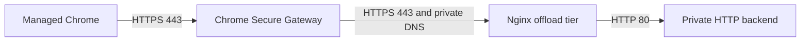
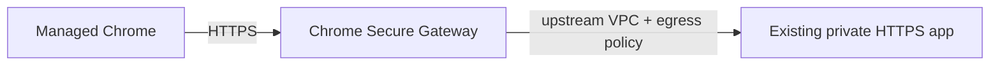
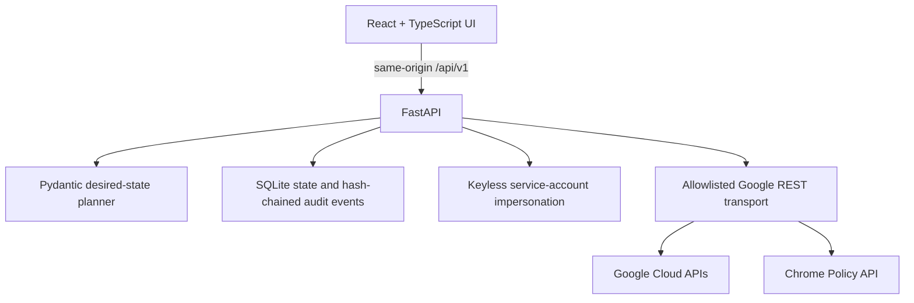

# Chrome Secure Gateway Local Web App — Implementation Plan

> **Historical design record.** This document preserves the original product
> plan. For version 0.2.1 runtime capabilities, release gates, and executable
> commands, use [`secure-gateway-studio/README.md`](../secure-gateway-studio/README.md)
> and [`secure-gateway-studio/docs/TEST_MATRIX.md`](../secure-gateway-studio/docs/TEST_MATRIX.md).

Updated: 2026-08-04

## 1. Objective

Turn the Chrome Secure Gateway private-application guides into a local,
approval-gated web application. The application must inspect the selected
Google Cloud and Google Workspace environment, show a deterministic desired
state plan, apply only the approved changes through Google APIs, validate the
result, and retain redacted evidence.

The application delivers two distinct deployment paths:

| Path | Source guide | When to use |
|---|---|---|
| **A — HTTP offload** | 22-page HTTP offload guide | The private application speaks HTTP only. The app builds an Nginx TLS-offload tier in front of it. |
| **B — Direct private HTTPS** | 19-page "Security Gateway for private apps (with DNS resolution)" guide | The private application already terminates TLS. Secure Gateway connects straight to it; no Nginx, VM, NAT, or offload certificate is created. |

The two paths share identity, approval, audit, Chrome policy, and evidence
machinery. They differ in desired-state topology, required permissions, and
acceptance vocabulary. Path B is described in section 16.

The product targets managed Google Chrome on:

- macOS;
- Windows;
- Linux; and
- ChromeOS.

It does not configure other browsers. The interface supports English and
Japanese through a persistent header dropdown.

## 2. Source-guide architecture

### 2.1 Path A — HTTP offload

The HTTP offload guide proves this path:



The app preserves the guide's key protocol boundary: the Secure Gateway
application matcher is HTTPS on port 443, while Nginx terminates TLS and proxies
to an HTTP-only backend.

### 2.2 Path B — direct private HTTPS

The second guide,
[Set up Security Gateway for private apps (with DNS resolution) in GCP](Set%20up%20Security%20Gateway%20for%20private%20apps%20%28with%20DNS%20resolution%29%20in%20GCP.pdf),
proves the shorter path:



Here the application already terminates TLS. The app creates no Nginx tier, no
VM, no Cloud NAT, and no offload certificate. Its entire job is the gateway,
the application matcher, the upstream VPC binding, access IAM, and Chrome
policy.

### 2.3 Shared guide-derived constants

| Item | Value |
|---|---|
| Secure Gateway source range | `136.124.16.0/20` |
| Secure Enterprise Browser extension | `ekajlcmdfcigmdbphhifahdfjbkciflj` |
| Endpoint Verification extension | `callobklhcbilhphinckomhgkigmfocg` |
| Path A application port | `443` |
| Path B application port | operator-supplied; defaults to `443` |
| Managed sample backend port | `80` |

Project IDs, IP addresses, hostnames, organization IDs, OUs, zones, networks,
and IAM principals are never copied from the guide.

## 3. Confirmed product decisions

1. The wizard has an explicit **Proof of concept / Production** trigger. The
   Production control is currently disabled in the UI while the backend
   implementation is retained; see sections 12 and 17.2.
2. Platform selection is limited to managed Google Chrome on the four supported
   operating systems.
3. Chrome policy changes must initially target the dedicated test OU.
4. Both a dedicated VPC and an existing VPC are supported.
5. Production is fail-closed and requires enterprise prerequisites, human
   approval, a managed-Chrome access level, and an immutable hardened image.
6. English and Japanese are first-class product locales.
7. The application is local-only and binds to loopback.

## 4. Certificate boundary

Three certificate strategies are supported:

### 4.1 Enterprise PKI / Certificate Authority Service

The app generates the server private key in process, sends only a CSR to
Certificate Authority Service, validates the returned certificate and chain,
and stores the TLS bundle directly in Secret Manager. The selected enterprise
root must already be trusted by the target desktop Chrome estate.

### 4.2 Publicly trusted certificate

The app references an existing Secret Manager secret containing the certificate
chain and private key. Preflight validates the secret contract, key match, DNS
SAN, and remaining validity. The secret must be in the deployment project.

### 4.3 Local PoC CA

The app creates an ephemeral private root, signs a separate leaf certificate,
exports only the public root as a local PEM artifact, and sends the leaf TLS
bundle to Secret Manager. The root private key is never persisted.

**Delivered behaviour differs from the original design.** This plan previously
specified automated root distribution through the Chrome Policy API
(`networks:defineCertificate` with
`chrome.networks.certificates.AllowForChromeDevices`), restricted to
deployments where **ChromeOS is the sole selected platform**. That path was
never built. Instead the administrator uploads the exported root through the
Google Admin console's Chrome Root Store and connects the configuration to the
test OU, which works for every managed-Chrome platform and therefore made the
ChromeOS-only restriction unnecessary. A non-blocking `chrome-root-store` gate
records the handoff and directs the operator to prove trust with the
platform-specific T07 test, because no public API can attest it. See
section 17.2.

Managed Chrome on Windows, macOS, and Linux must use either:

- an enterprise CA already trusted by the managed estate;
- a publicly trusted certificate; or
- a separately administered Chrome Enterprise Premium Root Store connector.

The Root Store connector is currently an Admin-console operation; the app does
not claim that it can create that connector through a public API.

## 5. Delivered local architecture



### Frontend

- React, TypeScript, and Vite;
- seven setup steps: Mode, Identities, Environment, Certificate, Access,
  Review, and Apply;
- bilingual English/Japanese message catalog and persistent locale selection;
- local draft persistence with versioned schema;
- read-only prepared plan and explicit approval/apply screens;
- deployment and evidence views;
- same-origin production bundle served by FastAPI.

### Backend

- FastAPI and Pydantic;
- direct Google REST requests through a strict hostname allowlist;
- SQLite repository for plans, approvals, runs, ownership, operations, and
  hash-chained audit events;
- single-use approval consumption and run creation in one transaction, with an
  atomic single-active-run lock that preserves a losing concurrent approval;
- approval, Apply, and operator evidence actors inherited from the Google
  identity captured by trusted preflight; browser-supplied actor fields are
  rejected;
- background apply execution with in-process polling;
- exact IAM and Chrome policy before-image restoration;
- ordered compensation for resources created during a failed run;
- startup reconciliation marks an unfinished prior run `interrupted`; it does
  not silently continue mutations after process restart.

### Local security controls

- loopback-only binding;
- per-launch 256-bit session nonce;
- exact Origin and Host validation for mutations;
- strict Content Security Policy and trusted-host middleware;
- no service-account JSON upload or long-lived key ADC;
- no access token, refresh token, private key, or Secret Manager payload stored
  in SQLite or browser storage;
- state database permission mode `0600`;
- no arbitrary command or URL execution from browser input;
- validated, typed provider operations only.

## 6. Desired production topology

This section describes Path A. Path B creates no compute, DNS, certificate, or
firewall resources at all; its desired state is listed in section 16.4.

Production creates:

- no VM external IPs;
- dedicated offload service account;
- two-zone regional managed instance group with a configurable minimum of two,
  CPU target, and capacity ceiling (defaults: 2-20 replicas at 60% CPU);
- regional internal TCP load balancer;
- SSL health check and health-check-only firewall rule;
- Shielded VM settings;
- an immutable versioned Compute Engine image with Python 3 and Nginx
  preinstalled;
- stable internal forwarding address and private DNS;
- narrowly scoped ingress from the Secure Gateway source range;
- Cloud NAT for private egress when the app creates the network;
- an optional managed private HTTP sample backend.

PoC creates one offload VM and may install packages at bootstrap. It remains
disposable and is not a production topology.

### 6.1 Scaling backend choice

Production keeps the Nginx tier in a regional managed instance group. An
internal passthrough Network Load Balancer supports either instance groups or
`GCE_VM_IP` zonal NEGs, but not both. A NEG is an endpoint registration model;
it is useful for hand-managed endpoints, overlapping endpoint groups, or
non-`nic0` interfaces, but it does not replace a managed instance group's
autoscaling and autohealing.

The app therefore creates a regional autoscaler for the Nginx MIG and exposes
minimum replicas, maximum replicas, and CPU target. Google documents that a MIG
behind an internal passthrough Network Load Balancer cannot scale from HTTP
load-balancing utilization, so CPU is the release's supported signal. Operators
must set the capacity ceiling from staged TLS throughput and connection tests.

## 7. Google API map

| Capability | API |
|---|---|
| API inventory and enablement | Service Usage |
| Billing association | Cloud Billing |
| Permission preflight and project IAM | Cloud Resource Manager / IAM |
| Service accounts | IAM |
| VPC, subnet, router/NAT, addresses, VMs, MIG, ILB, health checks, firewall | Compute Engine |
| Private DNS zone and A record | Cloud DNS |
| Gateway, application, and resource IAM | BeyondCorp |
| TLS payload | Secret Manager |
| Enterprise certificate issuance | Certificate Authority Service |
| Managed-Chrome access level validation | Access Context Manager |
| Extension policy and ChromeOS PoC root | Chrome Policy |

Three further APIs back the setup pickers and the discovery gates:

| Capability | API |
|---|---|
| OU and group pickers | Admin Directory (read-only scopes) |
| Managed-profile, extension, and Root Store gates | Chrome Management |
| Chrome Enterprise Premium license detection | Enterprise License Manager |

Required services are explicitly allowlisted:

```text
accesscontextmanager.googleapis.com
admin.googleapis.com
beyondcorp.googleapis.com
chromemanagement.googleapis.com
chromepolicy.googleapis.com
cloudbilling.googleapis.com
cloudresourcemanager.googleapis.com
compute.googleapis.com
dns.googleapis.com
iam.googleapis.com
iamcredentials.googleapis.com
iap.googleapis.com
licensing.googleapis.com
logging.googleapis.com
privateca.googleapis.com
secretmanager.googleapis.com
serviceusage.googleapis.com
```

The OAuth scope set is correspondingly wider than Cloud Platform plus Chrome
Policy alone: it adds `admin.directory.group.readonly`,
`admin.directory.orgunit.readonly`, `chrome.management.profiles.readonly`, and
`apps.licensing`. All four are read-only. Domain-wide delegation is still not
required, because every call is made as the impersonated deployer identity
using its directly assigned Chrome administrator role.

## 8. Preflight and approval gates

Preflight is read-only and must complete before an approval can be issued. It
checks:

- Application Default Credentials and the active principal;
- project billing association;
- required APIs;
- exact project permissions required by the selected topology;
- existing resource compatibility and same-name conflicts;
- existing VPC private egress;
- referenced public-certificate secret contents;
- immutable source-image existence and deprecation state;
- managed-Chrome access-level existence and CEL conditions;
- production licensing/service/Endpoint Verification confirmations;
- dedicated test OU confirmation;
- absence of external-IP configuration;
- valid private backend URL and hostname;
- distinct zones in the selected region;
- for Path B, an operator attestation that the selected VPC resolves the
  matcher hostname, permits ingress from `136.124.16.0/20`, and provides a
  return path.

Certificate strategy/platform compatibility is no longer checked; the
constraint it enforced was retired with the Chrome Policy root path described
in section 4.3.

The server attests the prepared plan and its configuration hash. Approval is
short-lived, bound to that plan, and single-use. Apply refuses changed,
expired, previously used, or server-unattested input.

## 9. Apply sequence

This is the Path A sequence. Path B executes only steps 1, 12, 13, 14, 15,
and 16 against an existing VPC; see section 16.4.

1. Enable the explicit service allowlist.
2. Create or reuse the selected network and subnet.
3. Create Cloud Router and NAT for a dedicated network.
4. Create dedicated service accounts and internal addresses.
5. Issue or validate the TLS certificate.
6. Create Secret Manager secret/version and least-privilege accessor IAM.
7. For a local PoC CA, export the public root PEM for Admin console upload.
   (Originally specified as a ChromeOS-only Chrome Policy API call; see
   section 4.3.)
8. Create the managed sample backend when selected.
9. Create the identity-scoped backend firewall before starting the offload
   tier, so bootstrap probes cannot race ingress creation.
10. Create the PoC offload VM or the production template, regional MIG, health
    check, backend service, and forwarding rule.
11. Create the remaining narrow firewall rules and private DNS.
12. Create or reuse the Secure Gateway, obtain its delegating service account,
    and grant required upstream access.
13. Create the Secure Gateway application with the exact hostname and port 443.
14. Apply gateway/application access IAM; Production application IAM is
    conditioned on the verified managed-Chrome access level.
15. Query the live Chrome app schemas, save before-images, force-install Secure
    Gateway and Endpoint Verification, and write the managed extension
    configuration.
16. Poll infrastructure health and record redacted operation evidence.

## 10. Failure and rollback behavior

- Provider mutations fail closed on unexpected response shapes.
- Compute and Google long-running operations are polled with a deadline.
- Resource creation uses request IDs where the API supports them.
- IAM modifications retain and restore the exact etag-bound before-image.
- Chrome app policy changes retain and restore the prior local value or
  inheritance state.
- A local PoC root export is compensated by deleting the exported artifact.
  Trust that the administrator has already distributed through the Admin
  console is outside the app's rollback scope and must be withdrawn there.
- Managed certificate versions are promoted through the Secret Manager
  `active` alias. A failed promotion or refresh restores the prior alias,
  disables the new version, and revokes the newly issued CA Service
  certificate.
- API enablement is intentionally monotonic and is not rolled back.
- Shared resources and resources not owned by the deployment are never deleted.
- An application restart marks an in-flight run interrupted for operator review.

## 11. Validation and evidence plan

The guide's T01–T09 tests remain the acceptance vocabulary:

| Test | Required evidence |
|---|---|
| T01 | backend-local HTTP 200 |
| T02 | offload-to-backend HTTP 200 |
| T03 | local TLS handshake, SAN/chain, and HTTP 200 |
| T04 | private DNS resolves to the offload address |
| T05 | persisted Secure Gateway matcher is hostname:443 |
| T06 | existing HTTPS control, when applicable |
| T07 | managed Chrome reaches the private application |
| T08 | correlated Secure Gateway/Nginx logs |
| T09 | unauthorized principal is denied |

The delivered acceptance runner records:

- T01 from a managed-backend local HTTP probe, or explicit operator evidence
  when the backend is externally managed;
- T02 and T03 from every offload VM through Compute Engine guest attributes;
- T04 from an exact Cloud DNS record/internal-address comparison;
- T05 from the persisted BeyondCorp application matcher;
- T06 from explicit control-path evidence;
- T07 from one explicit, sanitized result for every selected OS;
- T08 from correlated log evidence;
- T09 from separate unauthorized-principal and unmanaged-browser denial cases;
- durable timestamps, source attribution, redacted evidence, and audit-chain
  hashes.

Browser participation is still required for T07 and T09. The UI never labels
those tests passed based only on a server-side probe.

Path B narrows this matrix. T01–T04 are not applicable because no managed
backend, offload VM, or app-owned DNS record exists, so the required set is
T05, T06, and one T07 case per selected operating system, plus T08 and both
T09 cases in Production. See section 16.5.

## 12. Current implementation status

Verified against the working tree on 2026-08-04.

| Workstream | Status |
|---|---|
| Bilingual local UI and setup schema | Implemented |
| Seven-step wizard (Mode, Identities, Environment, Certificate, Access, Review, Apply) | Implemented |
| PoC trigger | Implemented |
| Production trigger | **Backend implemented; the UI control is deliberately disabled** and labelled "coming later" |
| Four managed-Chrome platform selectors | Implemented |
| Dedicated and existing VPC strategies | Implemented |
| Path A — HTTP offload topology | Implemented against fixtures |
| Path B — direct private HTTPS topology | Implemented against fixtures; see section 16 for gaps |
| Existing HTTP backends in GCP/AWS/Azure/on-premises | Implemented; private connectivity is an operator prerequisite, not something the app builds |
| Read-only discovery and deterministic plan | Implemented |
| Attested actor-bound approval, single-use Apply, and concurrent-run exclusion | Implemented |
| GCP/Workspace REST request builders and rollback | Implemented against fixtures |
| Production two-zone autoscaled offload topology | Implemented against fixtures; not reachable while the Production control is disabled |
| Managed-Chrome access-level enforcement | Implemented against fixtures |
| Chrome extension policy before-image rollback | Implemented against fixtures |
| Chrome Policy `networks:defineCertificate` root distribution | **Not implemented.** Superseded by a public-root PEM export for Admin console upload |
| Local PoC root export and Root Store handoff gate | Implemented |
| Keyless deployer bootstrap through the gcloud CLI | Implemented; argument arrays, no shell |
| Local audit chain and evidence export | Implemented |
| T01–T09 acceptance runner and bilingual evidence matrix | Implemented; live endpoint cases remain tenant-dependent |
| Managed enterprise certificate renewal and compensation | Implemented as an approval-gated lifecycle change |
| CI and dependency update gates | Implemented with path-scoped GitHub Actions and Dependabot |
| Unit/component test baseline | 135 backend tests and 17 frontend tests passing; 77% backend coverage against a 75% gate |
| Version control and CI execution | Tracked and pushed; the path-scoped workflow runs on `main` and on dependency PRs |
| Dependency update pipeline | Backend uv updates pass; the frontend Dependabot group currently fails the pnpm `minimumReleaseAge` lockfile policy |
| Live disposable-project provider certification | Pending access to staging credentials |
| T01–T09 live managed-Chrome matrix | Pending staging project, tenant, and endpoints |
| Cross-project upstream VPC for Path B | Not implemented |
| Global Access verification for regional internal load balancers | Not implemented |
| Unattended scheduled certificate rotation / continuous drift | Not implemented |
| Cross-restart automatic mutation resume | Not implemented; interrupted runs fail closed |
| External audit-chain anchoring | Not implemented; export to immutable external storage is required |

## 13. Release phases

### Phase A — Delivered staging release candidate

- local launcher and single-origin package;
- bilingual wizard;
- security controls;
- resource discovery, plan, approval, Apply, rollback, and audit evidence;
- PoC and Production topologies;
- fixture-backed provider and failure-path tests.

### Phase B — Required live integration certification

Use a disposable GCP project and dedicated Workspace/Chrome test OU to:

1. validate both Cloud and Chrome administrator authorization;
2. run a no-change preflight;
3. deploy and delete a dedicated-VPC PoC;
4. deploy a local-CA PoC, upload the exported root through the Admin console,
   and confirm policy and root trust on each selected platform;
5. deploy PoCs using enterprise and public certificate strategies;
6. deploy against a prepared existing VPC;
7. deploy a Path B direct private HTTPS application, confirming the live
   `upstreams[].egress_policy` request shape, a regional load balancer with
   Global Access, and a cross-project VPC once that is supported;
8. deploy the two-zone Production topology from the hardened source image;
9. execute T01–T09 on macOS, Windows, Linux, and ChromeOS as applicable, using
   the Path B subset from section 16.5 where it applies;
10. inject API, bootstrap, IAM-etag, and health-check failures;
11. prove rollback preserves shared VPC, gateway, OU, and existing certificate
    resources.

Exit criterion: all required tests have redacted evidence, T09 passes, and a
second plan reports only expected Reuse/No change results.

### Phase C — Production operations hardening

- unattended certificate-rotation scheduling and alerting;
- periodic drift detection;
- externally anchored or exported immutable audit records;
- operator roles and separate Cloud/Workspace credential sessions;
- durable cross-restart workflow continuation;
- stop/start and lifecycle actions;
- backup/restore and retention policy;
- signed release artifacts and organization-specific deployment runbook.

## 14. Production release gate

The codebase is a **staging-ready release candidate**, not yet a
production-certified deployment tool. Production authorization requires:

- a disposable staging GCP project with billing;
- Google Workspace/Chrome admin credentials scoped to the dedicated test OU;
- Chrome Enterprise Premium and Endpoint Verification in that OU;
- an existing managed-Chrome Access Context Manager access level;
- a versioned hardened VM image;
- one enrolled test endpoint for each required operating system;
- an approved enterprise CA or controlled public certificate;
- completion of the live Phase B matrix with exported evidence.

No amount of fixture testing can substitute for this tenant-specific release
gate because BeyondCorp and Chrome Policy availability, IAM delegation,
licenses, policy precedence, certificate trust, and endpoint enrollment are
external state.

## 15. Official references

- [Secure access to private web applications](https://docs.cloud.google.com/chrome-enterprise-premium/docs/security-gateway-private-web-apps)
- [Internal passthrough Network Load Balancer overview](https://docs.cloud.google.com/load-balancing/docs/internal)
- [Internal load balancer with managed instance-group backends](https://docs.cloud.google.com/load-balancing/docs/internal/setting-up-internal)
- [Zonal network endpoint groups](https://docs.cloud.google.com/load-balancing/docs/negs/zonal-neg-concepts)
- [Chrome Policy API setup and authorization](https://developers.google.com/chrome/policy/guides/setup)
- [Chrome Policy network and certificate samples](https://developers.google.com/chrome/policy/guides/networks-samples)
- [Define certificate](https://developers.google.com/chrome/policy/reference/rest/v1/customers.policies.networks/defineCertificate)
  — retained for reference only; not used by the delivered trust path
- [Remove certificate](https://developers.google.com/chrome/policy/reference/rest/v1/customers.policies.networks/removeCertificate)
  — retained for reference only; not used by the delivered trust path
- [Chrome Enterprise Premium Root Store management](https://support.google.com/chrome/a/answer/16073278)
- [Managed-Chrome custom access-level specification](https://docs.cloud.google.com/access-context-manager/docs/custom-access-level-spec)
- [Deploy Endpoint Verification](https://docs.cloud.google.com/endpoint-verification/docs/deploying-with-admin-console)
- [Set up Security Gateway for private apps (with DNS resolution) in GCP](Set%20up%20Security%20Gateway%20for%20private%20apps%20%28with%20DNS%20resolution%29%20in%20GCP.pdf)
  — the Path B source guide, stored in this directory

## 16. Path B — direct private HTTPS

### 16.1 Purpose

Path B publishes an application that already terminates TLS. It exists because
the HTTP offload tier is pure overhead when the target is a GKE ingress, an
internal load balancer, or any VM that already presents a valid certificate.
Selecting it renames the deployment to `secure-gateway-private-https` and
forces the existing-VPC network strategy, because the app must attach to the
network that already reaches the application.

### 16.2 Guide steps and their implementation

| Guide step | Implementation |
|---|---|
| 1. Create the Secure Gateway resource | `beyondcorp:security_gateway`; reused rather than created when `gateway_id` is `default` |
| 2–3. Private application and domain matchers | `endpoint_matchers: [{hostname, ports}]` |
| Only HTTPS endpoints are supported | The endpoint URL is rejected unless the scheme is `https`, and credentials, query, fragment, and non-root paths are refused |
| Matcher accepts VM IPs, GKE endpoints, LB IPs, or FQDNs | The host must be an RFC1918/ULA address or a fully qualified DNS name |
| Frontend IP **and port** | The port is parsed from the URL, defaults to 443, and is range-checked |
| 4. Upstream VPC network | `upstreams[].network` bound to the selected existing VPC |
| 5. Egress policy | Optional `application_egress_region` sets `upstreams[].egress_policy.regions`; left unset for cross-region-capable targets |
| 6. User permissions | `roles/beyondcorp.sgApplicationUser`, conditioned on the verified managed-Chrome access level when one is selected |
| Delegating service account IAM | `roles/beyondcorp.upstreamAccess` granted to the gateway's delegating account |

### 16.3 What the app deliberately does not create

The guide's firewall and DNS steps are treated as operator prerequisites rather
than app-owned resources, because in Path B the VPC and the application belong
to someone else. Both are folded into one blocking preflight gate,
`backend-connectivity`, whose confirmation text names each requirement:

- the ingress rule allowing TCP from `136.124.16.0/20`;
- private DNS resolution for the matcher hostname;
- a route to the application and a return path.

Apply refuses to proceed until that gate passes. This is a deliberate contrast
with Path A, where the app owns and rolls back the equivalent firewall and
Cloud DNS resources.

### 16.4 Desired state

Path B plans only: existing VPC (must exist), optional access level (must
exist), gateway, gateway IAM, upstream-access project IAM, application,
application IAM, the two force-installed extensions, the managed extension
configuration, and the Service Discovery proxy override. No subnet, router,
NAT, service account, address, secret, certificate, VM, template, MIG,
autoscaler, health check, backend service, forwarding rule, firewall, or DNS
resource is planned.

Required permissions collapse accordingly to the BeyondCorp, Resource Manager,
and Service Usage sets plus `compute.networks.get`, `compute.networks.use`, and
`accesscontextmanager.accessLevels.get`.

### 16.5 Acceptance vocabulary

T01–T04 do not apply: there is no managed backend to probe, no offload VM to
carry guest attributes, and no app-owned DNS record to compare. Path B requires
T05 (system-verified matcher), T06, and one operator-confirmed T07 case per
selected operating system. T08 and both T09 cases are added in Production.

### 16.6 Known gaps

1. **Cross-project upstream VPC is unsupported.** The guide's worked example
   places the VPC in a separate project and grants the delegating service
   account its roles in *that* project. The implementation hardcodes both the
   network path and the `upstreamAccess` binding to the deployment project.
   Single-project deployments are correct; the guide's own example is not
   expressible.
2. **Global Access is never verified.** The guide requires that a regional
   internal load balancer either has Global Access enabled on a frontend or is
   paired with an explicit egress policy, and flags this as a common failure.
   No preflight probe, gate, or diagnostic covers it; the only trace is one
   line of Guide-tab copy. Preflight already holds the hostname and the
   `compute.forwardingRules.get` permission, so a check is feasible.
3. **The `egress_policy` request shape is fixture-verified only.** Whether the
   field nests under `upstreams[]` as implemented must be confirmed against the
   live BeyondCorp API during Phase B.
4. **Firewall and DNS correctness rests entirely on operator attestation.**
   No API check confirms the ingress rule or the DNS record before Apply, so a
   false confirmation surfaces only at T07.

## 17. Conformance review — 2026-08-04

This section records where the delivered code and this plan disagreed, so the
two can be reconciled deliberately rather than by accident. Everything below
was verified against the working tree.

### 17.1 Confirmed conformant

Architecture, the seven named wizard steps, bilingual catalogues, versioned
draft persistence, loopback binding, per-launch nonce, CSP and trusted-host
middleware, `0600` state permissions, rejection of service-account-key ADC,
absence of tokens or key material in SQLite and browser storage, the
guide-derived constants, single-transaction approval consumption with a single
active Apply slot, hash-chained audit events, startup interrupted-run
reconciliation, ownership-bounded reverse-order rollback with etag-bound
before-images, Secret Manager alias promotion with disable-and-revoke
compensation, monotonic API enablement, the Path A apply ordering including the
backend firewall preceding the offload tier, and the two-zone autoscaled
production topology.

Gates run clean: `ruff` passes, 135 backend tests and 17 frontend tests pass,
and backend coverage is 77% against a 75% floor.

### 17.2 Divergences found in the Path A (HTTP offload) route

1. **Production is disabled in the UI.** The mode card is rendered `disabled`
   with a "coming later" label, while the backend implements Production in
   full. Sections 3 and 12 previously claimed the trigger shipped. The status
   table now distinguishes backend capability from UI reachability.
2. **ChromeOS root distribution through the Chrome Policy API was never
   built.** Neither `networks:defineCertificate` nor `networks:removeCertificate`
   appears anywhere in the codebase. The local PoC CA instead exports its public
   root as a PEM artifact for manual Chrome Root Store upload, tracked by a
   non-blocking handoff gate. Sections 4.3, 9, 10, and 12 described the API
   path as delivered.
3. **The ChromeOS-only restriction on the local PoC CA is absent.** Platform
   selection feeds only the configuration hash and per-OS T07 case generation;
   no certificate-strategy/platform compatibility check exists, though section 8
   lists one. The restriction became unnecessary once trust distribution moved
   to the Root Store handoff, but it was never formally retired.
4. **The API and scope surface is wider than section 7 described.** Admin
   Directory, Chrome Management, and Enterprise License Manager are allowlisted
   and required. Section 7 now documents them.
5. **Capabilities shipped that the plan never described:** the gcloud-backed
   deployer bootstrap endpoint, existing HTTP backends hosted in AWS, Azure, or
   on premises, the Service Discovery PAC override, and the Chrome Root Store
   discovery gate.
6. **T08 and both T09 cases are required only in Production.** Combined with
   the disabled Production control, no reachable configuration currently
   requires them, yet the Phase B exit criterion is "T09 passes."
7. **Origin validation is skipped when the header is absent.** The session
   nonce still gates every mutation, so this is not an exploitable hole, but
   "exact Origin and Host validation" overstated the check.
8. **The frontend dependency pipeline is red.** The path-scoped workflow runs
   on `main` and on dependency PRs, and the backend uv group passes, but the
   frontend Dependabot group fails at install: the proposed `pnpm-lock.yaml`
   contains packages newer than the configured `minimumReleaseAge` cutoff, so
   the policy rejects the lockfile. This is update-pipeline friction rather
   than a defect in the application code, but it leaves frontend dependency
   updates unable to merge.

### 17.3 Documentation defects found

- The application README asserts that the backend "does not call Admin
  Directory." It does, for the OU and group pickers.
- `SGSTUDIO_ACCESS_POLICY_ID` is required for access-level lookup and for the
  bootstrap's Policy Reader binding, but appears only in
  `.env.local.example`. Without it the access-level endpoint returns 428.
- Test counts in this plan were stale by roughly 50 backend cases.

## 18. Next steps

Ordered by what blocks the most downstream work. Items 1–3 are documentation
and correctness debt that can be cleared without a tenant; items 4–7 need cloud
or Workspace access.

### 18.1 Immediate — no external access required

1. **Unblock frontend dependency updates.** The Dependabot frontend group
   cannot merge while its regenerated `pnpm-lock.yaml` trips the
   `minimumReleaseAge` policy. Either widen the Dependabot schedule so
   proposed versions have aged past the cutoff, or relax the policy for that
   group. Until this clears, frontend security patches queue up unmerged.
2. **Correct the README's Admin Directory claim** and promote
   `SGSTUDIO_ACCESS_POLICY_ID` into the documented prerequisites and install
   steps.
3. **Decide the Production question explicitly.** Either re-enable the control
   and carry the full Production gate set, or state in the product that
   Production is out of scope for this release and mark the backend topology
   dormant. Leaving a fully implemented, unreachable path invites drift, and it
   currently makes T08/T09 unreachable as well.

### 18.2 Correctness work

4. **Add a Global Access preflight check for Path B.** Resolve the matcher to
   its forwarding rule and verify that either a frontend has Global Access
   enabled or an egress region is set. Fail the plan with a remediation
   message when neither holds. This is the highest-value missing check, because
   the guide names it as a common failure and the symptom otherwise appears
   only at T07.
5. **Support a cross-project upstream VPC for Path B.** Add an explicit VPC
   project field, use it in the network path, and place the `upstreamAccess`
   binding in that project. Until this lands, the guide's own worked example
   cannot be reproduced by the app.
6. **Reconcile the T08/T09 requirement with the reachable modes** so that a
   PoC that intends to prove denial behaviour can record it.

### 18.3 Requires staging access

7. **Run the Phase B live matrix**, extended to cover Path B: verify the
   `upstreams[].egress_policy` request shape against the live BeyondCorp API,
   deploy a direct-HTTPS application end to end, and confirm that a false
   `backend-connectivity` attestation fails at T07 rather than silently
   producing a broken deployment.

### 18.4 Deferred

Unattended certificate rotation, continuous drift detection, external
audit-chain anchoring, and cross-restart mutation resume remain out of scope
and are tracked in Phase C.
