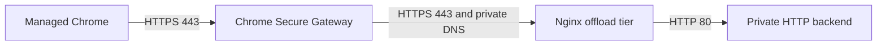
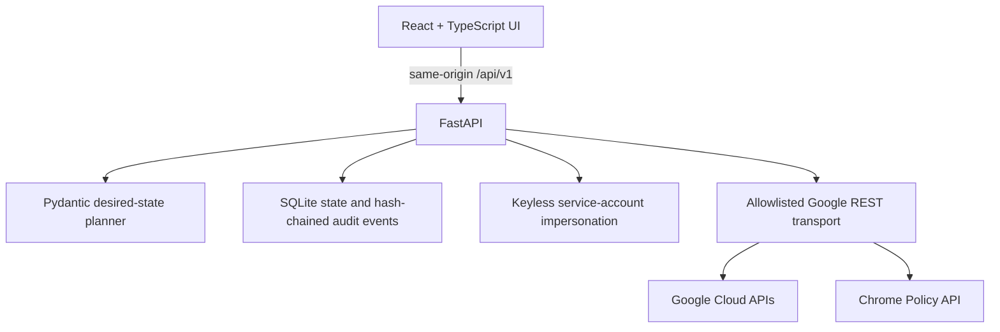

# Chrome Secure Gateway HTTP Offload Local Web App — Implementation Plan

Updated: 2026-07-31

## 1. Objective

Turn the 22-page Chrome Secure Gateway HTTP offload guide into a local,
approval-gated web application. The application must inspect the selected
Google Cloud and Google Workspace environment, show a deterministic desired
state plan, apply only the approved changes through Google APIs, validate the
result, and retain redacted evidence.

The product targets managed Google Chrome on:

- macOS;
- Windows;
- Linux; and
- ChromeOS.

It does not configure other browsers. The interface supports English and
Japanese through a persistent header dropdown.

## 2. Source-guide architecture

The source guide proves this path:



The app preserves the guide's key protocol boundary: the Secure Gateway
application matcher is HTTPS on port 443, while Nginx terminates TLS and proxies
to an HTTP-only backend.

Guide-derived constants that remain intentional:

| Item | Value |
|---|---|
| Secure Gateway source range | `136.124.16.0/20` |
| Secure Gateway extension | `ekajlcmdfcigmdbphhifahdfjbkciflj` |
| Endpoint Verification extension | `callobklhcbilhphinckomhgkigmfocg` |
| Application port | `443` |
| Managed sample backend port | `80` |

Project IDs, IP addresses, hostnames, organization IDs, OUs, zones, networks,
and IAM principals are never copied from the guide.

## 3. Confirmed product decisions

1. The wizard has an explicit **Proof of concept / Production** trigger.
2. Platform selection is limited to managed Google Chrome on the four supported
   operating systems.
3. Chrome policy changes must initially target the dedicated test OU.
4. Both a dedicated VPC and an existing VPC are supported.
5. Production is fail-closed and requires enterprise prerequisites, human
   approval, a managed-Chrome access level, and an immutable hardened image.
6. English and Japanese are first-class product locales.
7. The application is local-only and binds to loopback.

## 4. Certificate boundary

Three certificate strategies are supported:

### 4.1 Enterprise PKI / Certificate Authority Service

The app generates the server private key in process, sends only a CSR to
Certificate Authority Service, validates the returned certificate and chain,
and stores the TLS bundle directly in Secret Manager. The selected enterprise
root must already be trusted by the target desktop Chrome estate.

### 4.2 Publicly trusted certificate

The app references an existing Secret Manager secret containing the certificate
chain and private key. Preflight validates the secret contract, key match, DNS
SAN, and remaining validity. The secret must be in the deployment project.

### 4.3 Local PoC CA

The app creates an ephemeral private root, signs a separate leaf certificate,
uploads only the public root to the Chrome Policy API, and sends the leaf TLS
bundle to Secret Manager. The root private key is never persisted.

Google's public Chrome Policy API documents `networks:defineCertificate` with
`chrome.networks.certificates.AllowForChromeDevices`; this is the supported
automated trust path for ChromeOS devices. Therefore local PoC CA automation is
allowed only when **ChromeOS is the sole selected platform**.

Managed Chrome on Windows, macOS, and Linux must use either:

- an enterprise CA already trusted by the managed estate;
- a publicly trusted certificate; or
- a separately administered Chrome Enterprise Premium Root Store connector.

The Root Store connector is currently an Admin-console operation; the app does
not claim that it can create that connector through a public API.

## 5. Delivered local architecture



### Frontend

- React, TypeScript, and Vite;
- seven setup steps: Mode, Identities, Environment, Certificate, Access,
  Review, and Apply;
- bilingual English/Japanese message catalog and persistent locale selection;
- local draft persistence with versioned schema;
- read-only prepared plan and explicit approval/apply screens;
- deployment and evidence views;
- same-origin production bundle served by FastAPI.

### Backend

- FastAPI and Pydantic;
- direct Google REST requests through a strict hostname allowlist;
- SQLite repository for plans, approvals, runs, ownership, operations, and
  hash-chained audit events;
- single-use approval consumption and run creation in one transaction, with an
  atomic single-active-run lock that preserves a losing concurrent approval;
- approval, Apply, and operator evidence actors inherited from the Google
  identity captured by trusted preflight; browser-supplied actor fields are
  rejected;
- background apply execution with in-process polling;
- exact IAM and Chrome policy before-image restoration;
- ordered compensation for resources created during a failed run;
- startup reconciliation marks an unfinished prior run `interrupted`; it does
  not silently continue mutations after process restart.

### Local security controls

- loopback-only binding;
- per-launch 256-bit session nonce;
- exact Origin and Host validation for mutations;
- strict Content Security Policy and trusted-host middleware;
- no service-account JSON upload or long-lived key ADC;
- no access token, refresh token, private key, or Secret Manager payload stored
  in SQLite or browser storage;
- state database permission mode `0600`;
- no arbitrary command or URL execution from browser input;
- validated, typed provider operations only.

## 6. Desired production topology

Production creates:

- no VM external IPs;
- dedicated offload service account;
- two-zone regional managed instance group with a configurable minimum of two,
  CPU target, and capacity ceiling (defaults: 2-20 replicas at 60% CPU);
- regional internal TCP load balancer;
- SSL health check and health-check-only firewall rule;
- Shielded VM settings;
- an immutable versioned Compute Engine image with Python 3 and Nginx
  preinstalled;
- stable internal forwarding address and private DNS;
- narrowly scoped ingress from the Secure Gateway source range;
- Cloud NAT for private egress when the app creates the network;
- an optional managed private HTTP sample backend.

PoC creates one offload VM and may install packages at bootstrap. It remains
disposable and is not a production topology.

### 6.1 Scaling backend choice

Production keeps the Nginx tier in a regional managed instance group. An
internal passthrough Network Load Balancer supports either instance groups or
`GCE_VM_IP` zonal NEGs, but not both. A NEG is an endpoint registration model;
it is useful for hand-managed endpoints, overlapping endpoint groups, or
non-`nic0` interfaces, but it does not replace a managed instance group's
autoscaling and autohealing.

The app therefore creates a regional autoscaler for the Nginx MIG and exposes
minimum replicas, maximum replicas, and CPU target. Google documents that a MIG
behind an internal passthrough Network Load Balancer cannot scale from HTTP
load-balancing utilization, so CPU is the release's supported signal. Operators
must set the capacity ceiling from staged TLS throughput and connection tests.

## 7. Google API map

| Capability | API |
|---|---|
| API inventory and enablement | Service Usage |
| Billing association | Cloud Billing |
| Permission preflight and project IAM | Cloud Resource Manager / IAM |
| Service accounts | IAM |
| VPC, subnet, router/NAT, addresses, VMs, MIG, ILB, health checks, firewall | Compute Engine |
| Private DNS zone and A record | Cloud DNS |
| Gateway, application, and resource IAM | BeyondCorp |
| TLS payload | Secret Manager |
| Enterprise certificate issuance | Certificate Authority Service |
| Managed-Chrome access level validation | Access Context Manager |
| Extension policy and ChromeOS PoC root | Chrome Policy |

Required services are explicitly allowlisted:

```text
accesscontextmanager.googleapis.com
beyondcorp.googleapis.com
chromepolicy.googleapis.com
cloudbilling.googleapis.com
cloudresourcemanager.googleapis.com
compute.googleapis.com
dns.googleapis.com
iam.googleapis.com
iamcredentials.googleapis.com
iap.googleapis.com
logging.googleapis.com
privateca.googleapis.com
secretmanager.googleapis.com
serviceusage.googleapis.com
```

## 8. Preflight and approval gates

Preflight is read-only and must complete before an approval can be issued. It
checks:

- Application Default Credentials and the active principal;
- project billing association;
- required APIs;
- exact project permissions required by the selected topology;
- existing resource compatibility and same-name conflicts;
- existing VPC private egress;
- referenced public-certificate secret contents;
- immutable source-image existence and deprecation state;
- managed-Chrome access-level existence and CEL conditions;
- production licensing/service/Endpoint Verification confirmations;
- dedicated test OU confirmation;
- absence of external-IP configuration;
- valid private backend URL and hostname;
- distinct zones in the selected region;
- certificate strategy/platform compatibility.

The server attests the prepared plan and its configuration hash. Approval is
short-lived, bound to that plan, and single-use. Apply refuses changed,
expired, previously used, or server-unattested input.

## 9. Apply sequence

1. Enable the explicit service allowlist.
2. Create or reuse the selected network and subnet.
3. Create Cloud Router and NAT for a dedicated network.
4. Create dedicated service accounts and internal addresses.
5. Issue or validate the TLS certificate.
6. Create Secret Manager secret/version and least-privilege accessor IAM.
7. For ChromeOS-only local PoC, define the OU root certificate through Chrome
   Policy API.
8. Create the managed sample backend when selected.
9. Create the identity-scoped backend firewall before starting the offload
   tier, so bootstrap probes cannot race ingress creation.
10. Create the PoC offload VM or the production template, regional MIG, health
    check, backend service, and forwarding rule.
11. Create the remaining narrow firewall rules and private DNS.
12. Create or reuse the Secure Gateway, obtain its delegating service account,
    and grant required upstream access.
13. Create the Secure Gateway application with the exact hostname and port 443.
14. Apply gateway/application access IAM; Production application IAM is
    conditioned on the verified managed-Chrome access level.
15. Query the live Chrome app schemas, save before-images, force-install Secure
    Gateway and Endpoint Verification, and write the managed extension
    configuration.
16. Poll infrastructure health and record redacted operation evidence.

## 10. Failure and rollback behavior

- Provider mutations fail closed on unexpected response shapes.
- Compute and Google long-running operations are polled with a deadline.
- Resource creation uses request IDs where the API supports them.
- IAM modifications retain and restore the exact etag-bound before-image.
- Chrome app policy changes retain and restore the prior local value or
  inheritance state.
- A ChromeOS PoC root definition retains the returned certificate GUID and uses
  `networks:removeCertificate` during compensation.
- Managed certificate versions are promoted through the Secret Manager
  `active` alias. A failed promotion or refresh restores the prior alias,
  disables the new version, and revokes the newly issued CA Service
  certificate.
- API enablement is intentionally monotonic and is not rolled back.
- Shared resources and resources not owned by the deployment are never deleted.
- An application restart marks an in-flight run interrupted for operator review.

## 11. Validation and evidence plan

The guide's T01–T09 tests remain the acceptance vocabulary:

| Test | Required evidence |
|---|---|
| T01 | backend-local HTTP 200 |
| T02 | offload-to-backend HTTP 200 |
| T03 | local TLS handshake, SAN/chain, and HTTP 200 |
| T04 | private DNS resolves to the offload address |
| T05 | persisted Secure Gateway matcher is hostname:443 |
| T06 | existing HTTPS control, when applicable |
| T07 | managed Chrome reaches the private application |
| T08 | correlated Secure Gateway/Nginx logs |
| T09 | unauthorized principal is denied |

The delivered acceptance runner records:

- T01 from a managed-backend local HTTP probe, or explicit operator evidence
  when the backend is externally managed;
- T02 and T03 from every offload VM through Compute Engine guest attributes;
- T04 from an exact Cloud DNS record/internal-address comparison;
- T05 from the persisted BeyondCorp application matcher;
- T06 from explicit control-path evidence;
- T07 from one explicit, sanitized result for every selected OS;
- T08 from correlated log evidence;
- T09 from separate unauthorized-principal and unmanaged-browser denial cases;
- durable timestamps, source attribution, redacted evidence, and audit-chain
  hashes.

Browser participation is still required for T07 and T09. The UI never labels
those tests passed based only on a server-side probe.

## 12. Current implementation status

| Workstream | Status |
|---|---|
| Bilingual local UI and setup schema | Implemented |
| PoC / Production trigger | Implemented |
| Four managed-Chrome platform selectors | Implemented |
| Dedicated and existing VPC strategies | Implemented |
| Read-only discovery and deterministic plan | Implemented |
| Attested actor-bound approval, single-use Apply, and concurrent-run exclusion | Implemented |
| GCP/Workspace REST request builders and rollback | Implemented against fixtures |
| Production two-zone autoscaled offload topology | Implemented against fixtures |
| Managed-Chrome access-level enforcement | Implemented against fixtures |
| Chrome extension policy before-image rollback | Implemented against fixtures |
| ChromeOS-only local PoC root distribution | Implemented against official API contract and fixtures |
| Local audit chain and evidence export | Implemented |
| T01–T09 acceptance runner and bilingual evidence matrix | Implemented; live endpoint cases remain tenant-dependent |
| Managed enterprise certificate renewal and compensation | Implemented as an approval-gated lifecycle change |
| CI and dependency update gates | Implemented with path-scoped GitHub Actions and Dependabot |
| Unit/component test baseline | 85 backend tests and 9 frontend tests passing; backend coverage gate 75% |
| Live disposable-project provider certification | Pending access to staging credentials |
| T01–T09 live managed-Chrome matrix | Pending staging project, tenant, and endpoints |
| Unattended scheduled certificate rotation / continuous drift | Not implemented |
| Cross-restart automatic mutation resume | Not implemented; interrupted runs fail closed |
| External audit-chain anchoring | Not implemented; export to immutable external storage is required |

## 13. Release phases

### Phase A — Delivered staging release candidate

- local launcher and single-origin package;
- bilingual wizard;
- security controls;
- resource discovery, plan, approval, Apply, rollback, and audit evidence;
- PoC and Production topologies;
- fixture-backed provider and failure-path tests.

### Phase B — Required live integration certification

Use a disposable GCP project and dedicated Workspace/Chrome test OU to:

1. validate both Cloud and Chrome administrator authorization;
2. run a no-change preflight;
3. deploy and delete a dedicated-VPC PoC;
4. deploy a ChromeOS-only local-CA PoC and confirm policy/root trust;
5. deploy PoCs using enterprise and public certificate strategies;
6. deploy against a prepared existing VPC;
7. deploy the two-zone Production topology from the hardened source image;
8. execute T01–T09 on macOS, Windows, Linux, and ChromeOS as applicable;
9. inject API, bootstrap, IAM-etag, and health-check failures;
10. prove rollback preserves shared VPC, gateway, OU, and existing certificate
    resources.

Exit criterion: all required tests have redacted evidence, T09 passes, and a
second plan reports only expected Reuse/No change results.

### Phase C — Production operations hardening

- unattended certificate-rotation scheduling and alerting;
- periodic drift detection;
- externally anchored or exported immutable audit records;
- operator roles and separate Cloud/Workspace credential sessions;
- durable cross-restart workflow continuation;
- stop/start and lifecycle actions;
- backup/restore and retention policy;
- signed release artifacts and organization-specific deployment runbook.

## 14. Production release gate

The codebase is a **staging-ready release candidate**, not yet a
production-certified deployment tool. Production authorization requires:

- a disposable staging GCP project with billing;
- Google Workspace/Chrome admin credentials scoped to the dedicated test OU;
- Chrome Enterprise Premium and Endpoint Verification in that OU;
- an existing managed-Chrome Access Context Manager access level;
- a versioned hardened VM image;
- one enrolled test endpoint for each required operating system;
- an approved enterprise CA or controlled public certificate;
- completion of the live Phase B matrix with exported evidence.

No amount of fixture testing can substitute for this tenant-specific release
gate because BeyondCorp and Chrome Policy availability, IAM delegation,
licenses, policy precedence, certificate trust, and endpoint enrollment are
external state.

## 15. Official references

- [Secure access to private web applications](https://docs.cloud.google.com/chrome-enterprise-premium/docs/security-gateway-private-web-apps)
- [Internal passthrough Network Load Balancer overview](https://docs.cloud.google.com/load-balancing/docs/internal)
- [Internal load balancer with managed instance-group backends](https://docs.cloud.google.com/load-balancing/docs/internal/setting-up-internal)
- [Zonal network endpoint groups](https://docs.cloud.google.com/load-balancing/docs/negs/zonal-neg-concepts)
- [Chrome Policy API setup and authorization](https://developers.google.com/chrome/policy/guides/setup)
- [Chrome Policy network and certificate samples](https://developers.google.com/chrome/policy/guides/networks-samples)
- [Define certificate](https://developers.google.com/chrome/policy/reference/rest/v1/customers.policies.networks/defineCertificate)
- [Remove certificate](https://developers.google.com/chrome/policy/reference/rest/v1/customers.policies.networks/removeCertificate)
- [Chrome Enterprise Premium Root Store management](https://support.google.com/chrome/a/answer/16073278)
- [Managed-Chrome custom access-level specification](https://docs.cloud.google.com/access-context-manager/docs/custom-access-level-spec)
- [Deploy Endpoint Verification](https://docs.cloud.google.com/endpoint-verification/docs/deploying-with-admin-console)
