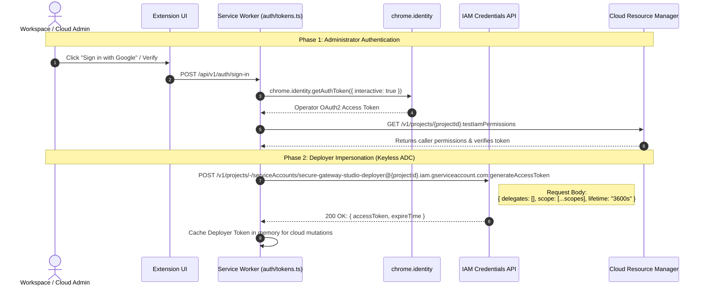
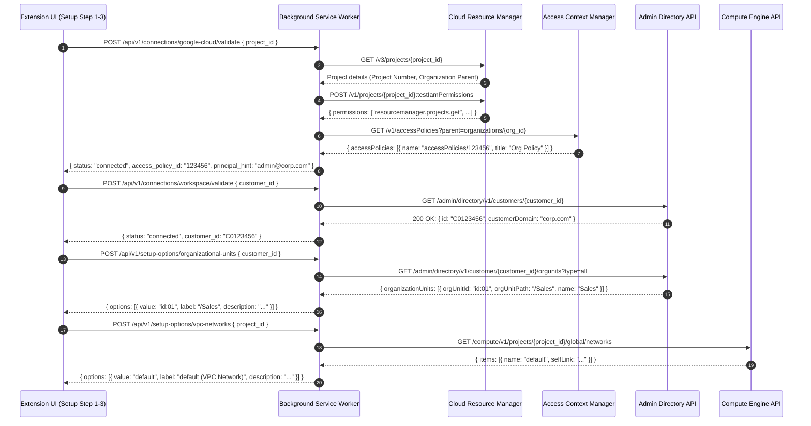
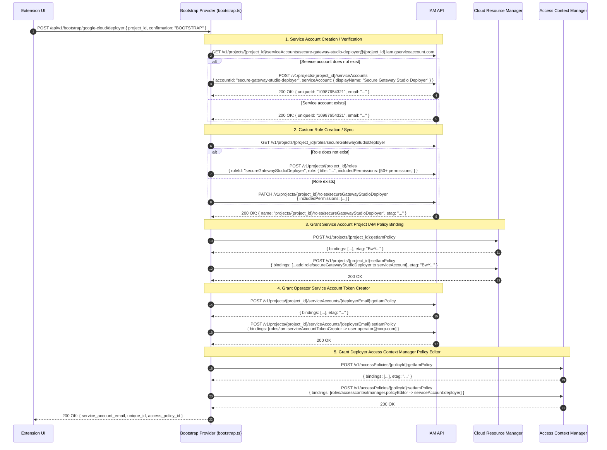
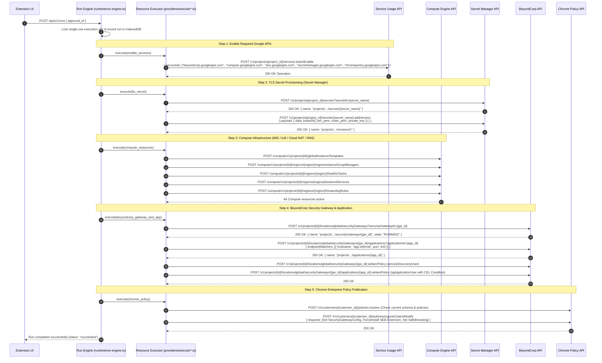
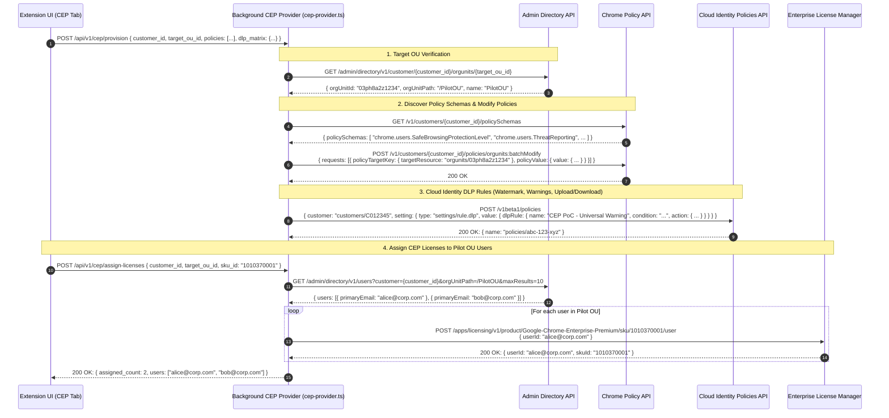
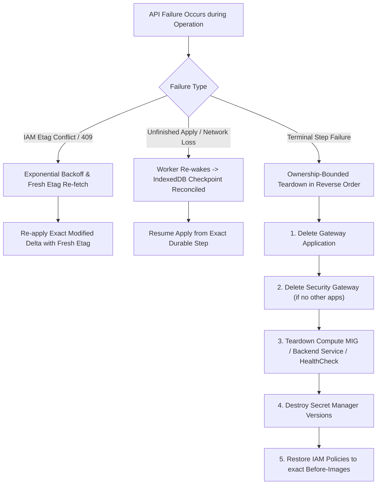

# Secure Gateway Studio — Chrome Extension Complete API & Architecture Reference

This document provides an exhaustive, end-to-end mapping of all API interactions, service-to-service flows, request schemas, response schemas, and rollback compensation mechanisms across the **Secure Gateway Studio Chrome Extension** (`secure-gateway-studio/extension/`).

---

## 1. High-Level Architecture Diagram

The extension runtime operates as a Chrome Manifest V3 service worker executing in an encrypted sandbox with two distinct authorization channels:
1. **Administrator Identity** (via `chrome.identity.getAuthToken()`): Used for Workspace Directory, Chrome Policy, Cloud Identity DLP, and initial Cloud Deployer bootstrap.
2. **Impersonated Service Account** (via `iamcredentials.googleapis.com`): Restricted project-scoped deployer identity (`secure-gateway-studio-deployer`) used for all Cloud Infrastructure mutations.

```mermaid
flowchart TB
    subgraph BrowserUI ["Chrome Extension Frontend (UI Layer)"]
        UI["Extension Popup / Full Tab React UI"]
        Transport["UI Transport Layer (ui/transport.ts)"]
    end

    subgraph ServiceWorker ["Chrome MV3 Service Worker (Background)"]
        Router["Internal Router (background/router.ts)"]
        EncryptedDB[("Encrypted IndexedDB & AES-256 State")]
        AuthManager["Auth & Token Manager (auth/tokens.ts)"]
        
        subgraph Providers ["Core Engine Providers"]
            Catalog["Catalog Provider (catalog.ts)"]
            Discovery["Discovery Provider (discovery.ts)"]
            Bootstrap["Bootstrap Provider (bootstrap.ts)"]
            Executor["Resource Executor (executor*.ts)"]
            CEP["CEP Provider (cep-provider.ts)"]
            Licensing["License Manager (licensing.ts)"]
            Observability["Observability Provider (observability.ts)"]
            Verifier["Acceptance Verifier (acceptance.ts)"]
        end
    end

    subgraph GoogleApis ["Google Cloud & Google Workspace APIs"]
        OAuth["OAuth2 / Chrome Identity (chrome.identity)"]
        IAMCreds["IAM Credentials API (iamcredentials.googleapis.com)"]
        CRM["Cloud Resource Manager API (cloudresourcemanager.googleapis.com)"]
        ServiceUsage["Service Usage API (serviceusage.googleapis.com)"]
        IAM["IAM API (iam.googleapis.com)"]
        Compute["Compute Engine API (compute.googleapis.com)"]
        DNS["Cloud DNS API (dns.googleapis.com)"]
        BeyondCorp["BeyondCorp Security Gateway API (beyondcorp.googleapis.com)"]
        ACM["Access Context Manager API (accesscontextmanager.googleapis.com)"]
        SecretManager["Secret Manager API (secretmanager.googleapis.com)"]
        PrivateCA["Certificate Authority Service (privateca.googleapis.com)"]
        Logging["Cloud Logging API (logging.googleapis.com)"]
        Directory["Workspace Admin Directory API (admin.googleapis.com)"]
        ChromePolicy["Chrome Policy API (chromepolicy.googleapis.com)"]
        CloudIdentity["Cloud Identity Policy API (cloudidentity.googleapis.com)"]
        EnterpriseLicense["Enterprise License Manager API (licensing.googleapis.com)"]
    end

    UI -->|chrome.runtime.sendMessage| Router
    Router <--> EncryptedDB
    Router --> AuthManager
    AuthManager -->|1. Operator OAuth Token| OAuth
    AuthManager -->|2. Mint Deployer Token| IAMCreds

    Router --> Catalog & Discovery & Bootstrap & Executor & CEP & Licensing & Observability & Verifier

    Catalog --> CRM & ACM & Directory & Compute
    Discovery --> CRM & ServiceUsage & Compute & DNS & BeyondCorp & ACM & ChromePolicy & Directory
    Bootstrap --> IAM & CRM & ACM
    Executor --> Compute & DNS & BeyondCorp & SecretManager & PrivateCA & ChromePolicy & CRM
    CEP --> ChromePolicy & Directory & CloudIdentity & ACM & CRM
    Licensing --> EnterpriseLicense & Directory
    Observability --> Logging
    Verifier --> BeyondCorp & Compute & DNS & ChromePolicy
```

---

## 2. Detailed API Sequence Diagrams

### 2.1. Authentication & Service Account Impersonation Flow

---

### 2.2. Connection Validation & Catalog Discovery Flow

---

### 2.3. Deployer Bootstrap Flow (`POST /api/v1/bootstrap/google-cloud/deployer`)

---

### 2.4. Apply & Execution Flow (Infrastructure Provisioning)

---

### 2.5. Chrome Enterprise Premium (CEP) Provisioning & License Assignment Flow

---

## 3. Exhaustive Google API Call & Response Reference

Below is the exhaustive catalog of every external Google API endpoint invoked by the extension.

| # | Service & Base URI | Method & Endpoint | Caller Identity | Request Body / Parameters | Response Structure | Purpose & Context |
|---|---|---|---|---|---|---|
| **1** | **OAuth 2.0 / Chrome Identity** | `chrome.identity.getAuthToken` | Operator User | `{ interactive: boolean, scopes: string[] }` | `token: string` | Acquires Google OAuth token for administrator Workspace/Cloud actions. |
| **2** | **OAuth 2.0** | `POST https://oauth2.googleapis.com/revoke` | Operator User | `?token={token}` | `200 OK` | Revokes the current access token upon sign-out. |
| **3** | **Cloud Resource Manager** `cloudresourcemanager.googleapis.com` | `GET /v3/projects/{projectId}` | Operator / Deployer | None | `{ name, projectId, projectNumber, state, parent: "organizations/{orgId}" }` | Discovers project number, organization parent, and verifies project existence. |
| **4** | **Cloud Resource Manager** | `POST /v1/projects/{projectId}:testIamPermissions` | Operator / Deployer | `{ permissions: string[] }` | `{ permissions: string[] }` | Tests whether current token holds critical permissions (IAM, Compute, BeyondCorp). |
| **5** | **Cloud Resource Manager** | `POST /v1/projects/{projectId}:getIamPolicy` | Operator User | `{ options: { requestedPolicyVersion: 3 } }` | `{ bindings: [{ role, members, condition }], etag, version }` | Reads project IAM bindings to calculate custom role bindings for deployer. |
| **6** | **Cloud Resource Manager** | `POST /v1/projects/{projectId}:setIamPolicy` | Operator User | `{ policy: { bindings, etag, version: 3 } }` | `{ bindings, etag, version: 3 }` | Binds `roles/secureGatewayStudioDeployer` to the deployer service account. |
| **7** | **IAM API** `iam.googleapis.com` | `GET /v1/projects/{projectId}/serviceAccounts/{email}` | Operator User | None | `{ name, projectId, uniqueId, email, displayName }` | Reads deployer service account identity and immutable `uniqueId`. |
| **8** | **IAM API** | `POST /v1/projects/{projectId}/serviceAccounts` | Operator User | `{ accountId: "secure-gateway-studio-deployer", serviceAccount: { displayName } }` | `{ name, uniqueId, email }` | Creates the dedicated, minimal-privilege deployer service account. |
| **9** | **IAM API** | `GET /v1/projects/{projectId}/roles/{roleId}` | Operator User | None | `{ name, title, includedPermissions: string[], stage, etag }` | Inspects current definition and etag of the product custom role. |
| **10** | **IAM API** | `POST /v1/projects/{projectId}/roles` | Operator User | `{ roleId: "secureGatewayStudioDeployer", role: { title, includedPermissions } }` | `{ name, includedPermissions, etag }` | Creates project custom role with exact required permissions. |
| **11** | **IAM API** | `PATCH /v1/projects/{projectId}/roles/{roleId}` | Operator User | `{ includedPermissions: string[], etag }` | `{ name, includedPermissions, etag }` | Synchronizes custom role permissions when schema updates occur. |
| **12** | **IAM API** | `POST /v1/projects/{projectId}/serviceAccounts/{email}:getIamPolicy` | Operator User | None | `{ bindings: [...], etag }` | Reads Service Account IAM policy to check Token Creator bindings. |
| **13** | **IAM API** | `POST /v1/projects/{projectId}/serviceAccounts/{email}:setIamPolicy` | Operator User | `{ policy: { bindings: [roles/iam.serviceAccountTokenCreator -> operatorEmail] } }` | `{ bindings: [...], etag }` | Grants operator permission to impersonate the deployer service account. |
| **14** | **IAM Credentials API** `iamcredentials.googleapis.com` | `POST /v1/projects/-/serviceAccounts/{email}:generateAccessToken` | Operator User | `{ delegates: [], scope: string[], lifetime: "3600s" }` | `{ accessToken: string, expireTime: string }` | Generates short-lived impersonated OAuth access token for cloud execution. |
| **15** | **Service Usage API** `serviceusage.googleapis.com` | `GET /v1/projects/{projectId}/services/{service}` | Deployer SA | None | `{ name, state: "ENABLED" \| "DISABLED" }` | Checks if required Google API services (e.g. `dns.googleapis.com`) are enabled. |
| **16** | **Service Usage API** | `POST /v1/projects/{projectId}/services:batchEnable` | Deployer SA | `{ serviceIds: string[] }` | Operation `{ name, done: true, response: {} }` | Batch-enables Compute, DNS, BeyondCorp, and Secret Manager APIs. |
| **17** | **Access Context Manager** `accesscontextmanager.googleapis.com` | `GET /v1/accessPolicies?parent=organizations/{orgId}` | Operator User | None | `{ accessPolicies: [{ name: "accessPolicies/123", title: "..." }] }` | Discovers available Access Context Manager access policy IDs for the organization. |
| **18** | **Access Context Manager** | `GET /v1/accessPolicies/{policyId}/accessLevels` | Operator / Deployer | `?accessLevelFormat=CEL` | `{ accessLevels: [{ name, title, basic \| custom }] }` | Lists existing Access Levels to populate UI access-level selector. |
| **19** | **Access Context Manager** | `POST /v1/accessPolicies/{policyId}/accessLevels` | Deployer SA | `{ name, title, custom: { expr: { expression: "..." } } }` | Operation -> `{ name, title, custom }` | Automatically provisions Managed Chrome Access Level (Profile or Browser). |
| **20** | **Access Context Manager** | `DELETE /v1/accessPolicies/{policyId}/accessLevels/{levelName}` | Deployer SA | None | Operation -> `{ done: true }` | Removes created Access Level during teardown / rollback. |
| **21** | **Access Context Manager** | `POST /v1/accessPolicies/{policyId}:getIamPolicy` | Operator User | None | `{ bindings: [...], etag }` | Reads Access Policy IAM policy to verify Policy Editor permissions. |
| **22** | **Access Context Manager** | `POST /v1/accessPolicies/{policyId}:setIamPolicy` | Operator User | `{ policy: { bindings: [roles/accesscontextmanager.policyEditor -> deployerSA] } }` | `{ bindings: [...], etag }` | Grants deployer service account Policy Editor rights on the access policy. |
| **23** | **Compute Engine API** `compute.googleapis.com` | `GET /compute/v1/projects/{projectId}/global/networks` | Deployer SA | `?maxResults=500` | `{ items: [{ name, selfLink, autoCreateSubnetworks }] }` | Enumerates VPC networks for network topology selection. |
| **24** | **Compute Engine API** | `GET /compute/v1/projects/{projectId}/regions/{region}/subnetworks` | Deployer SA | None | `{ items: [{ name, ipCidrRange, purpose, role }] }` | Enumerates subnets; checks proxy-only subnet presence for Option B. |
| **25** | **Compute Engine API** | `POST /compute/v1/projects/{projectId}/regions/{region}/subnetworks` | Deployer SA | `{ name, ipCidrRange, purpose: "REGIONAL_MANAGED_PROXY", role: "ACTIVE" }` | Regional Operation -> Subnetwork | Creates `REGIONAL_MANAGED_PROXY` subnetwork for Internal Application Load Balancer. |
| **26** | **Compute Engine API** | `GET /compute/v1/projects/{projectId}/global/firewalls` | Deployer SA | None | `{ items: [{ name, sourceRanges, allowed: [{ IPProtocol, ports }] }] }` | Reads firewall rules to verify ingress rules from BeyondCorp gateway IPs (`136.124.16.0/20`). |
| **27** | **Compute Engine API** | `POST /compute/v1/projects/{projectId}/global/firewalls` | Deployer SA | `{ name, network, sourceRanges: ["136.124.16.0/20"], allowed: [{ IPProtocol: "tcp", ports: ["443"] }] }` | Global Operation -> Firewall | Creates VPC ingress firewall rule for Secure Gateway proxy traffic. |
| **28** | **Compute Engine API** | `DELETE /compute/v1/projects/{projectId}/global/firewalls/{firewall}` | Deployer SA | None | Global Operation | Tears down created firewall rules upon teardown. |
| **29** | **Compute Engine API** | `POST /compute/v1/projects/{projectId}/global/instanceTemplates` | Deployer SA | `{ name, properties: { machineType, disks, networkInterfaces, metadata: { startup-script } } }` | Global Operation -> Template | Provisions Nginx offload instance template with hardened configuration. |
| **30** | **Compute Engine API** | `POST /compute/v1/projects/{projectId}/regions/{region}/regionInstanceGroupManagers` | Deployer SA | `{ name, instanceTemplate, targetSize, distributionPolicy: { zones } }` | Regional Operation -> MIG | Provisions regional Managed Instance Group spanning 2 zones. |
| **31** | **Compute Engine API** | `POST /compute/v1/projects/{projectId}/regions/{region}/regionAutoscalers` | Deployer SA | `{ name, target: MIG_URL, autoscalingPolicy: { minNumReplicas: 2, maxNumReplicas: 20, cpuUtilization: { utilizationTarget: 0.8 } } }` | Regional Operation -> Autoscaler | Configures CPU autoscaling for offload tier replicas. |
| **32** | **Compute Engine API** | `POST /compute/v1/projects/{projectId}/regions/{region}/healthChecks` | Deployer SA | `{ name, type: "SSL", sslHealthCheck: { port: 443 } }` | Regional Operation -> HealthCheck | Creates regional SSL health check for Internal Load Balancer. |
| **33** | **Compute Engine API** | `POST /compute/v1/projects/{projectId}/regions/{region}/backendServices` | Deployer SA | `{ name, protocol: "TCP", loadBalancingScheme: "INTERNAL", backends: [{ group: MIG_URL }] }` | Regional Operation -> BackendService | Configures regional Backend Service for Network/Application Load Balancer. |
| **34** | **Compute Engine API** | `POST /compute/v1/projects/{projectId}/regions/{region}/forwardingRules` | Deployer SA | `{ name, loadBalancingScheme: "INTERNAL", network, subnetwork, ports: ["443"], backendService }` | Regional Operation -> ForwardingRule | Provisions regional internal forwarding rule with private VIP. |
| **35** | **Compute Engine API** | `DELETE /compute/v1/projects/{projectId}/...` (All Compute resources) | Deployer SA | None | Operations | Reverses compute infrastructure in strict reverse-dependency order on teardown. |
| **36** | **Cloud DNS API** `dns.googleapis.com` | `GET /dns/v1/projects/{projectId}/managedZones` | Deployer SA | None | `{ managedZones: [{ name, dnsName, visibility: "private" }] }` | Lists Cloud DNS zones to find private matching zone for gateway endpoint. |
| **37** | **Cloud DNS API** | `POST /dns/v1/projects/{projectId}/managedZones` | Deployer SA | `{ name, dnsName: "app.internal.", visibility: "private", privateVisibilityConfig: { networks: [...] } }` | `{ name, id, dnsName }` | Creates private Cloud DNS zone bound to the target VPC network. |
| **38** | **Cloud DNS API** | `POST /dns/v1/projects/{projectId}/managedZones/{zone}/changes` | Deployer SA | `{ additions: [{ name: "app.internal.", type: "A", ttl: 300, rrdatas: [VIP_IP] }], deletions: [] }` | `{ id, status: "pending" \| "done" }` | Creates / deletes DNS `A` records routing app hostname to internal VIP. |
| **39** | **Secret Manager API** `secretmanager.googleapis.com` | `POST /v1/projects/{projectId}/secrets?secretId={secretId}` | Deployer SA | `{ replication: { automatic: {} } }` | `{ name: "projects/.../secrets/{id}", createTime }` | Creates Secret resource to hold TLS certificate bundle and private keys. |
| **40** | **Secret Manager API** | `POST /v1/projects/{projectId}/secrets/{secretId}:addVersion` | Deployer SA | `{ payload: { data: base64(JSON_STRING) } }` | `{ name: "projects/.../versions/1", state: "ENABLED" }` | Writes encrypted TLS certificate bundle version to Secret Manager. |
| **41** | **Secret Manager API** | `GET /v1/projects/{projectId}/secrets/{secretId}/versions/{version}:access` | Deployer SA | None | `{ payload: { data: base64 } }` | Reads secret version to verify certificate validity during preflight. |
| **42** | **Secret Manager API** | `DELETE /v1/projects/{projectId}/secrets/{secretId}` | Deployer SA | None | `{}` | Deletes secret upon teardown. |
| **43** | **Private CA Service** `privateca.googleapis.com` | `POST /v1/projects/{projectId}/locations/{loc}/caPools/{pool}/certificates:createCertificate` | Deployer SA | `{ certificate: { config: { subjectConfig, x509Config }, lifetime: "2592000s" } }` | Certificate Object with `{ pemCertificate, pemCertificateChain }` | Issues server TLS certificate from Google Cloud Certificate Authority Service. |
| **44** | **BeyondCorp API** `beyondcorp.googleapis.com` | `GET /v1/projects/{projectId}/locations/global/securityGateways` | Deployer SA | None | `{ securityGateways: [{ name, state, hubs }] }` | Discovers existing BeyondCorp Security Gateways in the project. |
| **45** | **BeyondCorp API** | `POST /v1/projects/{projectId}/locations/global/securityGateways?securityGatewayId={gwId}` | Deployer SA | `{ displayName: "...", hubs: [{ region: "us-central1" }] }` | Long-Running Operation -> SecurityGateway | Creates BeyondCorp Security Gateway resource. |
| **46** | **BeyondCorp API** | `POST /v1/projects/{projectId}/locations/global/securityGateways/{gwId}/applications?applicationId={appId}` | Deployer SA | `{ displayName, endpointMatchers: [{ hostname: "...", port: 443 }] }` | Long-Running Operation -> Application | Registers private web application behind the Security Gateway. |
| **47** | **BeyondCorp API** | `POST /v1/projects/{projectId}/locations/global/securityGateways/{gwId}:getIamPolicy` | Deployer SA | `{ options: { requestedPolicyVersion: 3 } }` | `{ bindings, etag }` | Reads Gateway IAM policy (`roles/beyondcorp.serviceDiscoveryUser`). |
| **48** | **BeyondCorp API** | `POST /v1/projects/{projectId}/locations/global/securityGateways/{gwId}:setIamPolicy` | Deployer SA | `{ policy: { bindings, etag } }` | `{ bindings, etag }` | Binds Service Discovery User role to target user group. |
| **49** | **BeyondCorp API** | `POST /v1/projects/{projectId}/locations/global/securityGateways/{gwId}/applications/{appId}:getIamPolicy` | Deployer SA | `{ options: { requestedPolicyVersion: 3 } }` | `{ bindings, etag }` | Reads Application IAM policy (`roles/beyondcorp.sgApplicationUser`). |
| **50** | **BeyondCorp API** | `POST /v1/projects/{projectId}/locations/global/securityGateways/{gwId}/applications/{appId}:setIamPolicy` | Deployer SA | `{ policy: { bindings: [{ role: "roles/beyondcorp.sgApplicationUser", members: [...], condition: { title, expression: "'accessPolicies/...' in request.auth.access_levels" } }], etag } }` | `{ bindings, etag }` | Binds Application User role with CEL Managed Chrome Access Level condition. |
| **51** | **Cloud Logging API** `logging.googleapis.com` | `POST /v2/entries:list` | Deployer SA | `{ resourceNames: ["projects/{id}"], filter: "resource.type=... AND timestamp >= ...", pageSize: 100 }` | `{ entries: [{ logName, timestamp, jsonPayload, severity }] }` | Fetches gateway connection logs, Nginx access logs, and audit trails. |
| **52** | **Workspace Admin Directory** `admin.googleapis.com` | `GET /admin/directory/v1/customers/{customerId}` | Operator User | None | `{ id: "C0123456", customerDomain: "corp.com", postalAddress }` | Discovers canonical customer ID (`C...`) from domain name or alias. |
| **53** | **Workspace Admin Directory** | `GET /admin/directory/v1/customer/{customerId}/orgunits` | Operator User | `?type=all` | `{ organizationUnits: [{ orgUnitId, orgUnitPath, name, parentOrgUnitId }] }` | Lists all Organizational Units in the tenant to populate OU pickers. |
| **54** | **Workspace Admin Directory** | `POST /admin/directory/v1/customer/{customerId}/orgunits` | Operator User | `{ name: "CEP Users", parentOrgUnitPath: "/Pilot" }` | `{ orgUnitId, orgUnitPath, name }` | Creates child pilot sub-OUs (`CEP Users`, `CEP Browsers`) if requested. |
| **55** | **Workspace Admin Directory** | `GET /admin/directory/v1/groups?customer={customerId}` | Operator User | `?maxResults=200` | `{ groups: [{ id, email, name, description }] }` | Lists Google Workspace groups to select target user principal group. |
| **56** | **Workspace Admin Directory** | `GET /admin/directory/v1/users?customer={customerId}&orgUnitPath={ouPath}` | Operator User | `?maxResults=10` | `{ users: [{ primaryEmail, name, id }] }` | Enumerates users within the exact pilot OU for license assignment. |
| **57** | **Chrome Policy API** `chromepolicy.googleapis.com` | `GET /v1/customers/{customerId}/policySchemas` | Operator User | None | `{ policySchemas: [{ name: "chrome.users.SecurityGatewayConfig", definition: {...} }] }` | Discovers live supported policy schemas and fields for the tenant. |
| **58** | **Chrome Policy API** | `POST /v1/customers/{customerId}/policies:resolve` | Operator User | `{ policyTargetKey: { targetResource: "orgunits/{ouId}" }, policySchemaFilter: "chrome.users.*" }` | `{ resolvedPolicies: [{ policyValue: { value: {...} }, sourceKey: {...} }] }` | Resolves existing active policy values before applying modifications. |
| **59** | **Chrome Policy API** | `POST /v1/customers/{customerId}/policies/orgunits:batchModify` | Operator User | `{ requests: [{ policyTargetKey: { targetResource: "orgunits/{ouId}" }, policyValue: { policyNamespace: "chrome.users", value: { ... } }, updateMask: "..." }] }` | `{ responses: [{ ... }] }` | Applies Security Gateway routes, SEB extension force-install, and DLP connectors. |
| **60** | **Cloud Identity Policy API** `cloudidentity.googleapis.com` | `POST /v1beta1/policies` | Operator User | `{ customer: "customers/{id}", setting: { type: "settings/rule.dlp", value: { dlpRule: { name: "CEP PoC - Watermark", condition: "...", action: { watermark: true } } } } }` | `{ name: "policies/dlp-12345", createTime }` | Creates starter Data Loss Prevention (DLP) rules (watermark, download warning). |
| **61** | **Cloud Identity Policy API** | `DELETE /v1beta1/policies/{policyId}` | Operator User | None | `{}` | Deletes created Cloud Identity DLP rule upon rollback. |
| **62** | **Enterprise License Manager** `licensing.googleapis.com` | `POST /apps/licensing/v1/product/{productId}/sku/{skuId}/user` | Operator User | `{ userId: "user@corp.com" }` | `{ kind: "licenseAssignment", userId, productId, skuId }` | Directly assigns Chrome Enterprise Premium SKU licenses to pilot OU users. |
| **63** | **Enterprise License Manager** | `DELETE /apps/licensing/v1/product/{productId}/sku/{skuId}/user/{userId}` | Operator User | None | `204 No Content` | Removes assigned CEP license from user upon rollback. |

---

## 4. Rollback, Failure Recovery & Compensation Mechanisms

The extension enforces strict lifecycle safety rules during failures:

### Safety Guarantees:
1. **Never Delete Shared Resources:** If a VPC network or DNS zone was pre-existing (`owned: false`, `shared: true`), it is untouched; only newly added records are removed.
2. **Reverse-Order Dependency Deletion:** Teardown strictly follows dependency DAG in reverse order (Applications $\rightarrow$ Gateways $\rightarrow$ Forwarding Rules $\rightarrow$ MIGs $\rightarrow$ Instances $\rightarrow$ Templates $\rightarrow$ Secrets $\rightarrow$ Roles).
3. **Fail-Closed IAM Restoration:** Application and Gateway IAM policies always record exact `beforeImage` copies in IndexedDB before mutation. In case of partial failure, `restoreIamPolicyWithFreshEtag` rolls back bindings safely.
4. **Encrypted State at Rest:** All sensitive credentials, tokens, plans, before-images, and audit events are encrypted with **AES-256-GCM** in IndexedDB, preventing disk-level leakage.
